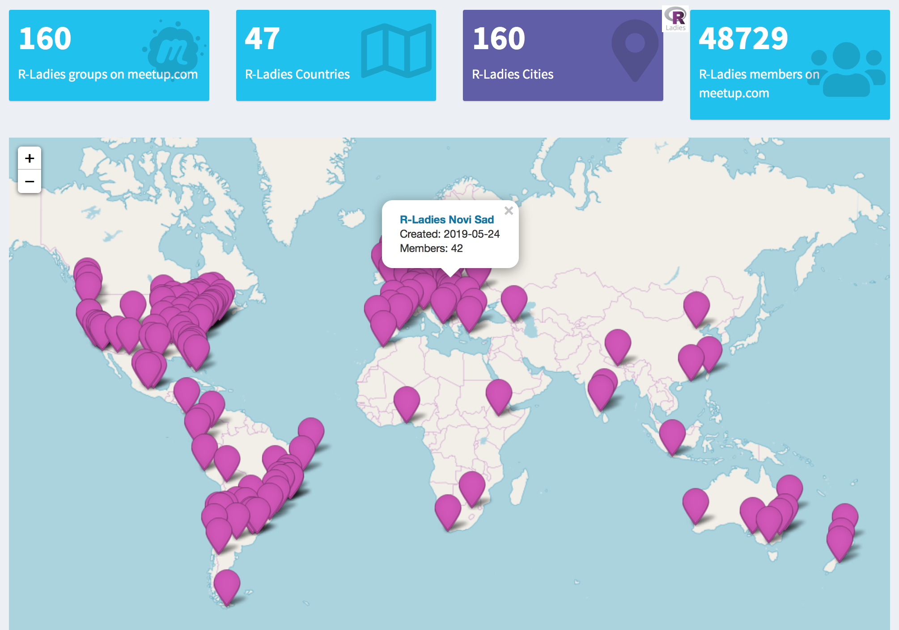
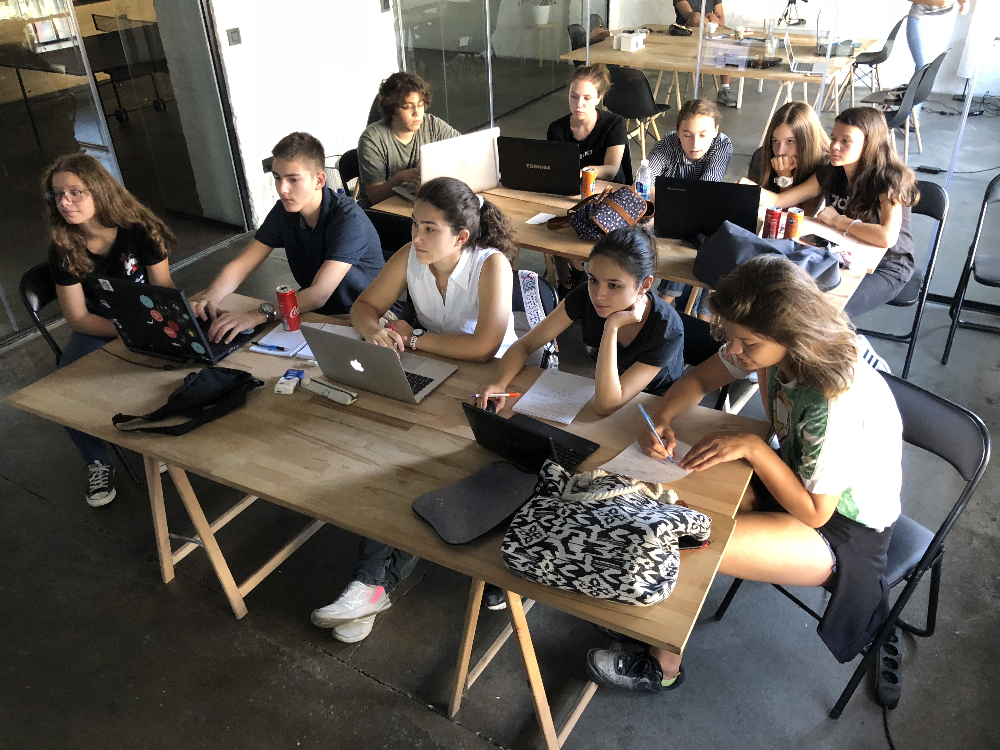
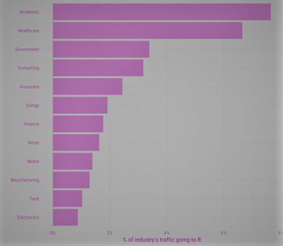

class: inverse, middle

background-image: url("rladies-wide-logo.png")
background-position: top right
background-size: 15% 10%

<!-- Tri crtice --- su pocetak slajda
A iznad njih su redom naslov, podnaslov, 
autor, datum, paket koji je koriscen i 
koji css fajlovi.-->

<!-- Zatim su postavljene
osobine slajda, tj. definisemo njegovu 
klasu koju posle mozemo menjati, tj. 
definisati unutar odgovarajuceg css fajla.-->

<!-- Nakon klase definisana je pozadina slajda.-->

#   ** Meet  R Ladies Novi Sad **  

<!-- # sluzi da stavimo doznanja R -u da je upitanju naslov
Ukoliko koristimo vise # kao sto je to ispit uradjeno, teks
ce biti manji.-->

<!-- Komanda  tekst  sluzi 
da promenimo boju teksta, u ovom slucaju boja iz R spektra 
je deeppink.-->

<!-- **tekst** Dve zvezdice ispred i nakon teksta sluze da 
bi se tekst potamnio, tj. za opciju bold. -->

.pull-left[
- ### Tatjana Kecojevic
- ### Maja Pokusevski     
- ### Milena Kresoja 
- ### Katica Ristić
- ### Ranka Medenica Todorović
- ### Olivera Grljević
]

<!-- Komanda .pull-left[] i .pull-right[]
sluze da se prostor slajda podeli u dve kolone.
-->
<!-- Komanda jedna crtica sluzi da bi se oznacila
teza -->

.pull-right[

]

<!-- Ukoliko zelite da ubacite sliku/animacije koja nije pozadina 
to mozete uraditi komandom 
pri cemu mozete odrediti mesto prikazivanja slike, kao i njenu visinu/velicinu
-->

---

class: inverse, middle

background-image: url("Pozadina.png")
background-position: center
background-size: 96% 97%

#  ** Who are R - Ladies Global **           
---

class: inverse, middle

background-image: url("Pozadina.png")
background-position: center
background-size: 96% 97%

.pull-left[

]

.pull-right[
## Worldwide organisation that promotes gender diversity in the R community via meetups and mentorship in friendly and safe environment. 
]          

---
class: inverse, middle

background-image: url("Pozadina.png")
background-position: center
background-size: 96% 97%

.pull-left[

 - R-Ladies Global, designed to improve the gender diversity of R users worldwide and in particular, to improve the participation and experience of women in the R community.
]

.pull-right[

- **R-Ladies Novi Sad** will host a number of talks and workshops about the use of R. It doesn't matter if you never used R or if you are an R expert, **R-Ladies Novi Sad** welcomes anyone with an interest in R. 

- The goal is to promote R, exchange knowledge and create an R community among women. 

- We are fully inclusive and respectful of LGBT identities - our priority is to provide a safe community space for anyone identifying as female who is interested in and/or working with R.
]

---
class: inverse, middle

background-image: url("Pozadina.png")
background-position: center
background-size: 96% 97%

#   We're a part of it!   

---

class: inverse, middle

background-image: url("rladies-wide-logo.png")
background-position: top right
background-size: 15% 10%

#   ** Meet  R Ladies Novi Sad **  

.pull-left[
- ###  Tatjana Kecojecić  
- ### Maja Pokusevski     
- ### Milena Kresoja 
- ### Katica Ristić
- ### Ranka Medenica Todorović
- ### Olivera Grljević
]

.pull-right[

]

---

class: inverse, top

background-image: url("rladies-wide-logo.png")
background-position: top right
background-size: 15% 10%

# **Tatjana kecojević** 

.pull-left[
### **Education**
- University of Manchester, UK; Ph.D., Statistics

- University of Central Lancashire, UK; PGCert. Postgraduate Certificate in Teaching and Learning in Higher Education

- University of Belgrade, Serbia; BSc, Information Systems Engineering

]

.pull-right[

### Work Experience

- **2018 - date**  DS instructor at DataTeka

- **2000 - 2017**  Senior University lecturer of Quantitative Modelling
]

---

class: inverse, top

background-image: url("rladies-wide-logo.png")
background-position: top right
background-size: 15% 10%

# **Tatjana kecojević: Community Activities** 

<!-- Ubacivanje linka je jednostavno pomocu zagrada ubaciti [Naziv Linka](link) -->

- [**klikR**](http://klikr.rbind.io) is an initiative designed to introduce and make accessible the art world of data science with the focus on the younger generation, existing students and those wishing to change the course of their career. It fosters greater inclusivity and gender diversity.

- **Surveys leader for [R Forwards](https://forwards.github.io/)**: R Foundation taskforce on women and other under-represented groups.

- **[R-Ladies](https://rladies.org/)** Manchester, BG, NS

- Member of the Program Committee **Data Science Conference 5.0** (**[DSC 5.0](https://datasciconference.com/)**) 

- 2019 WiDS Ambassadors at **Women in Data Science** ([**WiDS**](https://widssubotica.netlify.com)) at Stanford University: aims to inspire and educate data scientists worldwide, regardless of gender, and support women in the field.

- [**RBootcamp**](http://rbootcamp.rbind.io) is a platform built to provide an insightful overview on the data democracy process through the use of free open source data analysis software packages.

---

class: inverse, middle

background-image: url("rladies-wide-logo.png")
background-position: top right
background-size: 15% 10%

#   ** Meet  R Ladies Novi Sad ** 

.pull-left[
- ### Tatjana Kecojecić  
- ###  Maja Pokusevski      
- ### Milena Kresoja 
- ### Katica Ristić
- ### Ranka Medenica Todorović      
- ### Olivera Grljević
]

.pull-right[

]

---
class: inverse, middle

background-image: url("rladies-wide-logo.png")
background-position: top right
background-size: 15% 10%

#**Maja Pokusevski**

.pull-left[
## **Education**
-  **BSc** Psychology
-  **MSc** Applied Statistics
]

.pull-right[
## **Work Experience**
-  **2011 - 2016:** Freelance - Data science and Applied statistics 
-  **2016 - :** Data analyst - Ninamedia Research, Novi Sad
]

---

class: inverse, middle

background-image: url("rladies-wide-logo.png")
background-position: top right
background-size: 15% 10%

#   ** Meet  R Ladies Novi Sad ** 

.pull-left[
- ### Tatjana Kecojecić  
- ### Maja Pokusevski     
- ###  Milena Kresoja 
- ### Katica Ristić
- ### Ranka Medenica Todorović     
- ### Olivera Grljević
]

.pull-right[

]

---

class: inverse, top

background-image: url("rladies-wide-logo.png")
background-position: top right
background-size: 15% 10%

# **Milena Kresoja** 

.pull-left[
## **Education**
-  **BSc** Finantial Mathematics
-  **MSc** Applied Mathematics
-  **PhD** Numerical Optimization
]

.pull-right[
## Work Experience
-  **2011 - 2018:** Center of Applied Statistics, Novi Sad
-  **2011 - 2018:** Faculty of Sciences, Novi Sad
-  **2018 - ** Institute of Economic Sciences, Belgrade
-  **2018 - ** ARPM, New York

]

---

class: inverse, middle

background-image: url("Pozadina.png")
background-position: center
background-size: 96% 97%

#  **R in Novi Sad** 

.pull-left[

]

.pull-right[
###  **Start** 
###  **2011 - MAS: Center of Applied Statistics, Novi Sad** 
#### <  **teaching** 
#### <  **consluting** 
]

---

class: inverse, middle

background-image: url("Pozadina.png")
background-position: center
background-size: 96% 97%

#  **R in Novi Sad** 

.pull-left[

]

.pull-right[
###  **Now** 
###  **2018 - UCPS, PMF, FTN, PF, TF, EF...** 
]

---

class: inverse, middle

background-image: url("Pozadina.png")
background-position: center
background-size: 96% 97%

#  **Visit to R by industry** 

.pull-left[

]

.pull-right[
###  **Based on visits to Stack Overflow questions** 
]

---

class: inverse, middle

background-image: url("rladies-wide-logo.png")
background-position: top right
background-size: 15% 10%

#   ** Meet  R Ladies Novi Sad ** 

.pull-left[
- ### Tatjana Kecojecić  
- ### Maja Pokusevski      
- ### Milena Kresoja 
- ###  Katica Ristić 
- ### Ranka Medenica Todorović    
- ### Olivera Grljević
]

.pull-right[

]

---

class: inverse, top

background-image: url("rladies-wide-logo.png")
background-position: top right
background-size: 15% 10%

# **Katica Ristić** 

.pull-left[
## **Education**
-  **MSc** Applied Mathematics
-  **MIT MicroMasters** Statistics and Data Science
## Work Experience
-  **2008 - 2019** Teacher of Mathematics, Bećej and Veternik
]

.pull-right[
## Talks
-  **April 2019** WiDS Conference, Subotica
-  **Maj 2019** Data Science Serbia Meetup #29, Beograd
-  **Jun 2019** R - Ladies Novi Sad Meetup #1, Novi Sad
]

---

class: inverse, top

background-image: url("Pozadina.png")
background-position: center
background-size: 96% 97%

#  **Petition** 

---

class: inverse, middle

background-image: url("rladies-wide-logo.png")
background-position: top right
background-size: 15% 10%

#  ** Meet  R Ladies Novi Sad ** 

.pull-left[
- ### Tatjana Kecojecić  
- ### Maja Pokusevski      
- ### Milena Kresoja 
- ### Katica Ristić
- ###  Ranka Medenica Todorović     
- ### Olivera Grljević
]

.pull-right[

]

---

class: inverse, top

background-image: url("rladies-wide-logo.png")
background-position: top right
background-size: 15% 10%

# **Ranka Medenica Todorović** 

.pull-left[
## **Education**
-  **BSc** Sociology
-  **MSc** Regional Planning and Development
-  **PhD** Architecture and Urban Planning

## Learning R
- PhD thesis development: implementation of the user-generated content on social media for the purpose of defining urban planning and development parameters
]

.pull-right[
## Work Experience
-  **2013 - 2014:** Centre for European Regional and Local Studies - EUROREG, University of Warsaw
-  **2014 - 2018:** Department of Architecture and Urban Planning, Faculty of Technical Sciences, University of Novi Sad
]

---

class: inverse, middle

background-image: url("rladies-wide-logo.png")
background-position: top right
background-size: 15% 10%

#   ** Meet  R Ladies Novi Sad ** 

.pull-left[
- ### Tatjana Kecojecić  
- ### Maja Pokusevski      
- ### Milena Kresoja 
- ### Katica Ristić
- ### Ranka Medenica Todorović      
- ###  Olivera Grljević 
]

.pull-right[

]

---
class: inverse, middle

background-image: url("Pozadina.png")
background-position: center
background-size: 96% 97%

#  **Olivera Grljević ** 

.pull-left[
## **Education** 
-  **BSc** Economics - Business Information Systems 
-  **MSc** Economics - Business Information Systems 
-  **PhD** Business Informatics 
]

.pull-right[
## **Work Experience & current projects** 
-  **2007 - Present** Faculty of Economics, University of Novi Sad 
-  **- ** Sentiment analysis of user-generated content written in Serbian 
-  **- ** Automated classification of images in online ads 
-  **- ** ADA team member 

]

---

class: inverse, middle, center

background-image: url("Pozadina.png")
background-position: center
background-size: 96% 97%

#  ** Thanks for listening :) ** 

#  ** Follow R - Ladies Novi Sad on ** 
### [ Twitter: R - Ladies Novi Sad ](https://twitter.com/RLadiesNoviSad?s=03)      
### [ Meetup: R - Ladies Novi Sad ](https://www.meetup.com/rladies-novi-sad/)
### [ GitHub rladies ](https://github.com/rladies/meetup-presentations_novi-sad)
#  ** Contact R - Ladies Novi Sad ** 
##  **novisad@rladies.org**      
##  Let us build projects together!

---

class: inverse, middle

background-image: url("Pozadina.png")
background-position: center
background-size: 96% 97%

#  **Meet Novi Sad through R** 

<!-- I to bi bilo to! -->
<!-- Cestitamo! Savladali smo svi zajedno kako praviti prezentaciju u R-u -->
<!-- Ovaj Tamplate slobodno mozete koristiri za VASU PRVU R PREZENTACIJU -->
<!-- PUNO SRECE U UCENJU R-a ZELE TI R-LADIES NOVI SAD-->
