class: inverse, middle


background-image: url("rladies-wide-logo.png")
background-position: top right
background-size: 15% 10%

<!-- Tri crtice --- su pocetak slajda
A iznad njih su redom naslov, podnaslov, 
autor, datum, paket koji je koriscen i 
koji css fajlovi.-->

<!-- Zatim su postavljene
osobine slajda, tj. definisemo njegovu 
klasu koju posle mozemo menjati, tj. 
definisati unutar odgovarajuceg css fajla.-->


<!-- Nakon klase definisana je pozadina slajda.-->


#  <span style="color:aliceblue"> ** Meet  R Ladies Novi Sad ** </span> 

<!-- # koristimo da stavimo doznanja R -u da je u pitanju naslov.
Ukoliko koristimo vise # kao sto je to ispit uradjeno, teks
ce biti manji.-->

<!-- Komanda <span style="color:deeppink"> tekst </span> koristi se 
za menjanje boje teksta, u ovom slucaju boja iz R spektra 
je deeppink.-->

<!-- **tekst** Dve zvezdice ispred i nakon teksta koristimo da 
 potamnimo tekst, tj. za opciju bold. -->


.pull-left[
- ## Olivera Grljević
- ## Maja Pokuševski     
- ## Milena Kresoja 
- ## Ranka Medenica Todorović
- ## Katica Ristić
- ## Tatjana Kecojević
]

<!-- Komanda .pull-left[] i .pull-right[]
koristimo da prostor slajda podeli u dve kolone.
-->
<!-- Komanda jedna crtica sluzi da bi se oznacila
teza -->


.pull-right[

]

<!-- Ukoliko zelite da ubacite sliku/animacije koja nije pozadina 
to mozete uraditi komandom 
pri cemu mozete odrediti mesto prikazivanja slike, kao i njenu visinu/velicinu
-->

---

class: inverse, middle


background-image: url("Pozadina.png")
background-position: center
background-size: 96% 97%

# <span style="color:#a1007a"> ** Who are R - Ladies Global ** </span>          
---

class: inverse, middle


background-image: url("Pozadina.png")
background-position: center
background-size: 96% 97%

.pull-left[

]

.pull-right[
##<span style="color:#a1007a"> Worldwide organisation that promotes gender diversity in the R community via meetups and mentorship in friendly and safe environment. </span>
]          

---
class: inverse, middle


background-image: url("Pozadina.png")
background-position: center
background-size: 96% 97%

.pull-left[


<span style="color:#a1007a"> - R-Ladies Global, designed to improve the gender diversity of R users worldwide and in particular, to improve the participation and experience of women in the R community.</span>
]

.pull-right[


<span style="color:#a1007a">- **R-Ladies Novi Sad** will host a number of talks and workshops about the use of R. It doesn't matter if you never used R or if you are an R expert, **R-Ladies Novi Sad** welcomes anyone with an interest in R.</span> 

<span style="color:#a1007a">- The goal is to promote R, exchange knowledge and create an R community among women.</span> 

<span style="color:#a1007a">- We are fully inclusive and respectful of LGBT identities - our priority is to provide a safe community space for anyone identifying as female who is interested in and/or working with R.</span>
]

---
class: inverse, middle


background-image: url("Pozadina.png")
background-position: center
background-size: 96% 97%

# <span style="color:#a1007a">  We're a part of it!  </span> 


---


class: inverse, middle, center


background-image: url("Pozadina.png")
background-position: center
background-size: 96% 97%


#  <span style="color:#a1007a"> ** Vizualizacija ** </span> 
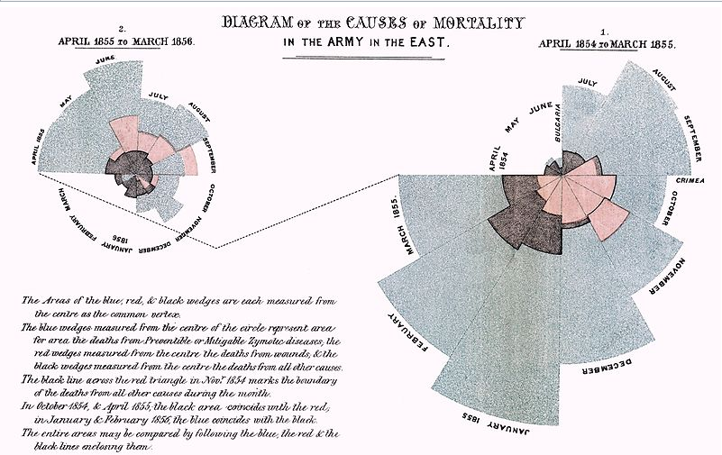


---


class: inverse, middle, center


background-image: url("Pozadina.png")
background-position: center
background-size: 96% 97%


#  <span style="color:#a1007a"> ** Nekada... ** </span> 

[<span style="color:mediumblue"> Storytelling: Minard vs. Nightingale ](https://eagereyes.org/journalism/storytelling-minard-vs-nightingale)

.pull-left[ 
[<span style="color:mediumblue"> Florence Nightingale](https://sr.wikipedia.org/wiki/Флоренс_Најтингејл)
[<span style="color:mediumblue"> "Diagram of the causes of mortality in the army in the East"](https://public.tableau.com/en-us/gallery/recreating-florence-nightingales-coxcomb-chart)


]

.pull-right[ 

[<span style="color:mediumblue"> Charles Minard’s visualization of Napoleon’s Russian campaign in 1812/13](https://en.wikipedia.org/wiki/Charles_Joseph_Minard) 

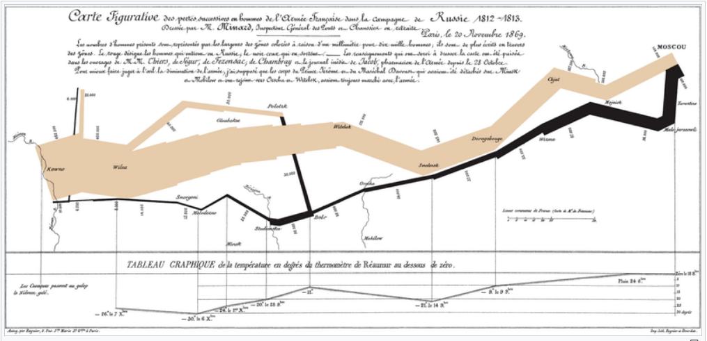


]

---


class: inverse, middle, center


background-image: url("Pozadina.png")
background-position: center
background-size: 96% 97%


#  <span style="color:#a1007a"> ** Sad :) ** </span> 

.pull-left[ 
[<span style="color:mediumblue"> Tableau Viz of the day ](https://public.tableau.com/en-us/gallery/?tab=viz-of-the-day&type=viz-of-the-day)

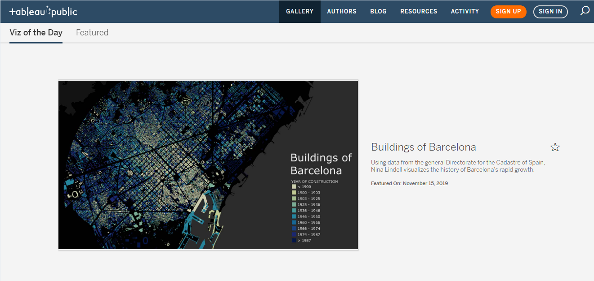
]

.pull-right[ 

[<span style="color:mediumblue"> Edward Tufte ](https://www.edwardtufte.com/tufte/)

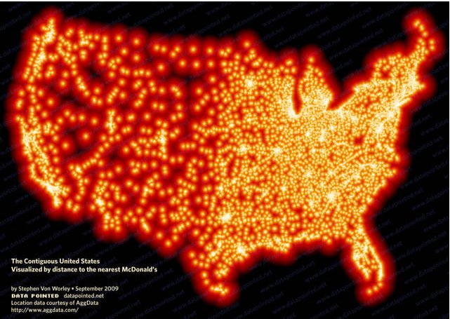

]

---


class: inverse, middle, center


background-image: url("Pozadina.png")
background-position: center
background-size: 96% 97%


#  <span style="color:#a1007a"> ** Šta je vizualizacija? ** </span> 

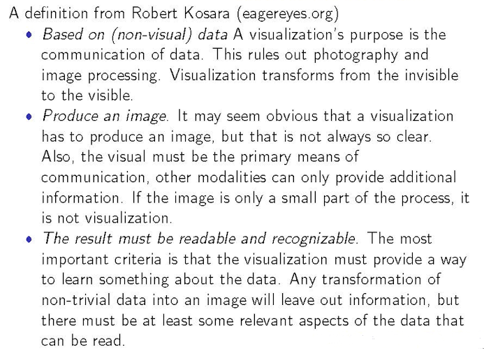


---


class: inverse, middle, center


background-image: url("Pozadina.png")
background-position: center
background-size: 96% 97%


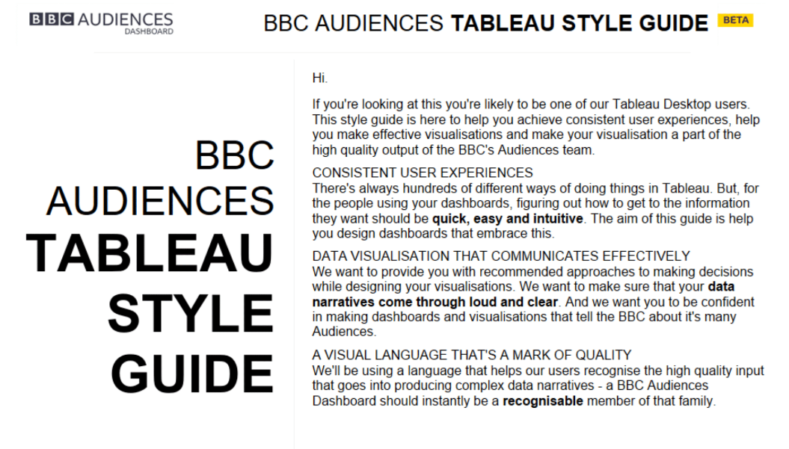

---


class: inverse, middle, left


background-image: url("Pozadina.png")
background-position: left
background-size: 96% 97%

#  <span style="color:#a1007a"> ** Šta je cilj vizualizacije? ** </span> 

<span style="color:#a1007a">  - Pokaže podatke

<span style="color:#a1007a">  - Ne laže u vezi podataka

<span style="color:#a1007a">  - Ilustuje priču: pokaže uzročnost, paterne, otkrića

<span style="color:#a1007a">  - Smanji "nered"

<span style="color:#a1007a">  - Ubedljivo isporuči informaciju

<span style="color:#a1007a">  - Vuzualno mora komplementirati tekst i poseduje dovoljno informacija da stoji sama


---


class: inverse, middle, left


background-image: url("Pozadina.png")
background-position: left
background-size: 96% 97%

##  <span style="color:#a1007a"> ** Loš graf 1 ** </span> 

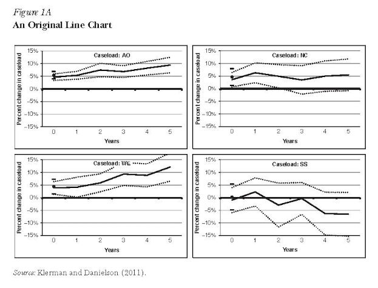

---


class: inverse, middle, left


background-image: url("Pozadina.png")
background-position: left
background-size: 96% 97%

##  <span style="color:#a1007a"> ** Dobar graf 1 ** </span> 

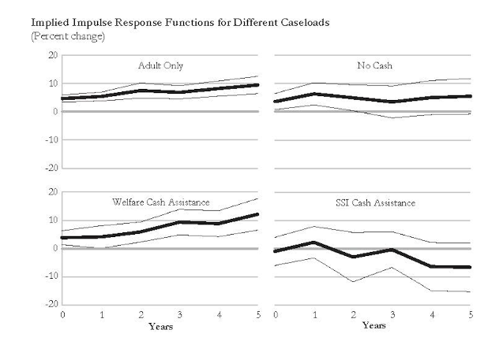

---


class: inverse, middle, left


background-image: url("Pozadina.png")
background-position: left
background-size: 96% 97%

##  <span style="color:#a1007a"> ** Loš graf 2 ** </span> 

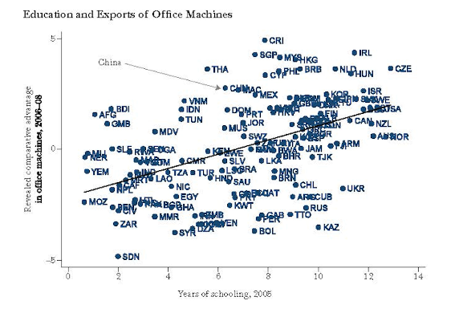


---


class: inverse, middle, left


background-image: url("Pozadina.png")
background-position: left
background-size: 96% 97%

##  <span style="color:#a1007a"> ** Dobar graf 2 ** </span> 

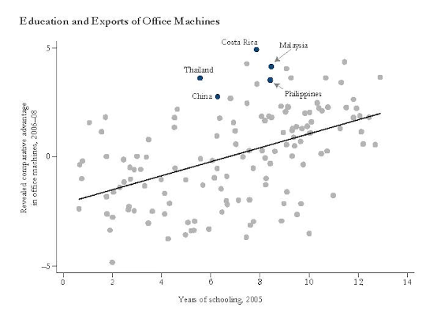


---


class: inverse, middle, left


background-image: url("Pozadina.png")
background-position: left
background-size: 96% 97%

##  <span style="color:#a1007a"> ** Loš graf 3 ** </span> 

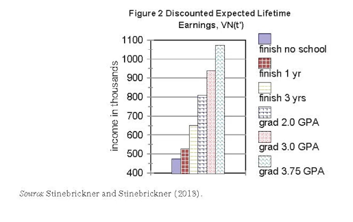


---


class: inverse, middle, left


background-image: url("Pozadina.png")
background-position: left
background-size: 96% 97%

##  <span style="color:#a1007a"> ** Dobar graf 3 ** </span> 

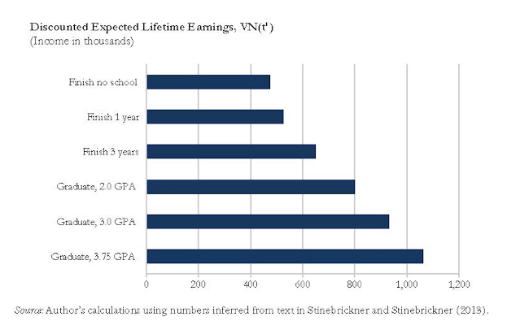

---


class: inverse, middle, left


background-image: url("Pozadina.png")
background-position: left
background-size: 96% 97%

##  <span style="color:#a1007a"> ** Loš graf 4 ** </span> 

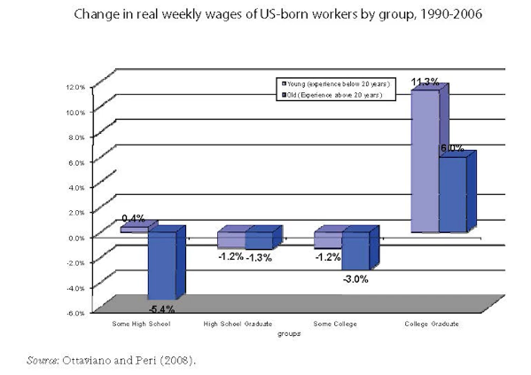

---


class: inverse, middle, left


background-image: url("Pozadina.png")
background-position: left
background-size: 96% 97%

##  <span style="color:#a1007a"> ** Dobar graf 4 ** </span> 

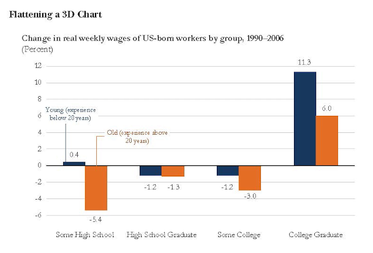


---


class: inverse, middle, left


background-image: url("Pozadina.png")
background-position: left
background-size: 96% 97%

##  <span style="color:#a1007a"> ** Loš graf 5 ** </span> 

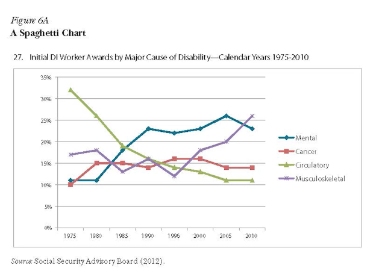


---


class: inverse, middle, left


background-image: url("Pozadina.png")
background-position: left
background-size: 96% 97%

##  <span style="color:#a1007a"> ** Dobar graf 5 ** </span> 

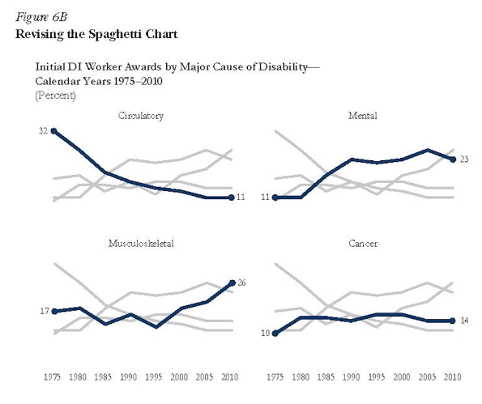


---


class: inverse, middle, left


background-image: url("Pozadina.png")
background-position: left
background-size: 96% 97%

##  <span style="color:#a1007a"> ** Loš graf 6 ** </span> 

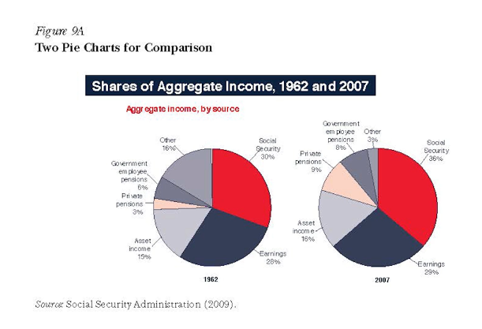

---


class: inverse, middle, left


background-image: url("Pozadina.png")
background-position: left
background-size: 96% 97%

##  <span style="color:#a1007a"> ** Dobar graf 6 ** </span> 

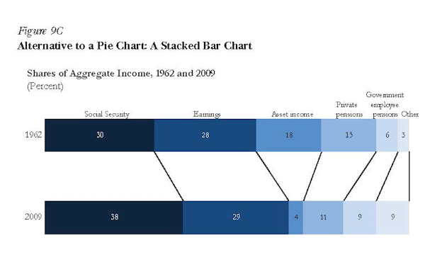

---


class: inverse, middle, left


background-image: url("Pozadina.png")
background-position: left
background-size: 96% 97%

##  <span style="color:#a1007a"> ** Šta želimo da postignemo? ** </span> 

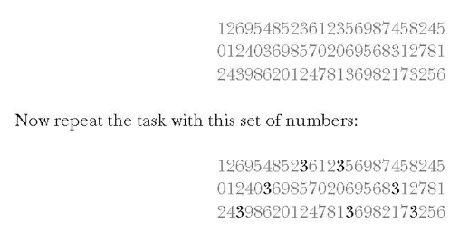

---

class: inverse, middle, left


background-image: url("Pozadina.png")
background-position: left
background-size: 96% 97%

##  <span style="color:#a1007a"> ** Tufte-ovi principi ** </span> 

<span style="color:#a1007a">  - Pokaže podatke

<span style="color:#a1007a">  - Maksimiziraj ink podataka (bez dodatnih linija, osa, bez ponavljanja procenata)

<span style="color:#a1007a">  - Obrisati suvišne informacije  

<span style="color:#a1007a">  - Izbegavajte nepotrebne dodatke vizualizaciji 

<span style="color:#a1007a">  - Povećati "gustinu" prikaza podataka

<span style="color:#a1007a">  - Grafikoni bi trebalo da su horizontalni 

<span style="color:#a1007a">  - Grafikoni bi trebalo da su horizontalni 

---


class: inverse, middle, left


background-image: url("Pozadina.png")
background-position: left
background-size: 96% 97%

##  <span style="color:#a1007a"> ** Primer na delu! ** </span> 

[<span style="color:black"> Darkhorse Analytics ](https://www.darkhorseanalytics.com/blog/data-looks-better-naked)


---


class: inverse, middle, center


background-image: url("Pozadina.png")
background-position: center
background-size: 96% 97%


#  <span style="color:#a1007a"> ** Lean2Shiny ** </span> 
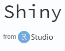


---


class: inverse, middle


background-image: url("Pozadina.png")
background-position: center
background-size: 96% 97%

#  <span style="color:#a1007a"> ** Kako početi? ** </span> 


### <span style="color:#a1007a"> 1. Otvori R Studio </span>
### <span style="color:#a1007a"> 2. Instaliraj paket <span style="color:mediumblue"> **Shiny**  </span>  

<span style="color:#a1007a"> Sećaš se? Imaš dve opcije: </span> 

.pull-left[  
<span style="color:#a1007a"> - install.packages("shiny")   
] 
.pull-right[

<span style="color:mediumblue"> -  **Packages -> Install** </span> 
<span style="color:#a1007a"> u desnom donjem delu R Studio-a

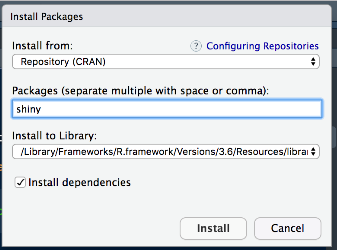
 ]

---

class: inverse, middle


background-image: url("Pozadina.png")
background-position: center
background-size: 96% 97%

#  <span style="color:#a1007a"> ** Kako početi? ** </span> 

 [<span style="color:mediumblue"> Idite na naš GitHub](https://github.com/rladies/meetup-presentations_novi-sad) 


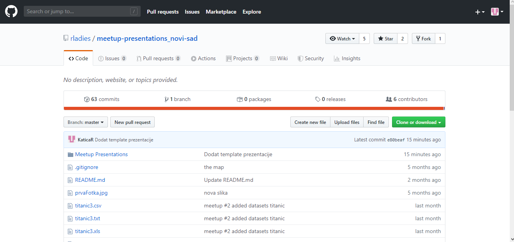 

---

class: inverse, middle


background-image: url("Pozadina.png")
background-position: center
background-size: 96% 97%

#  <span style="color:#a1007a"> ** Kako pokrenuti Shuny projekat? ** </span> 


.pull-left[
<span style="color:#a1007a">   **File -> New Project** </span>

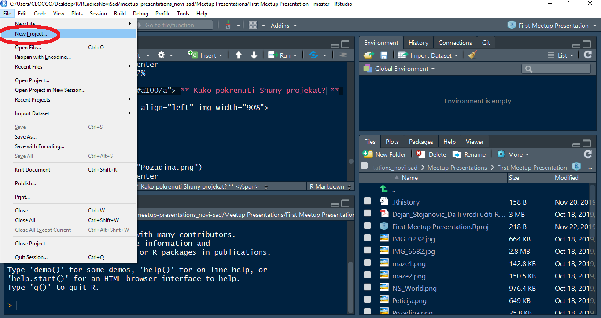 
]
.pull-right[
<span style="color:#a1007a">   **New Directory -> **    
<span style="color:#a1007a">   **Shiny Web Application -> **     
<span style="color:#a1007a">   **Create Shiny Web Application** </span>

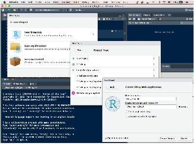 
]

---

class: inverse, middle


background-image: url("Pozadina.png")
background-position: center
background-size: 96% 97%

#  <span style="color:#a1007a"> ** Šta je potrebno da bi ShinyApp radila? ** </span> 

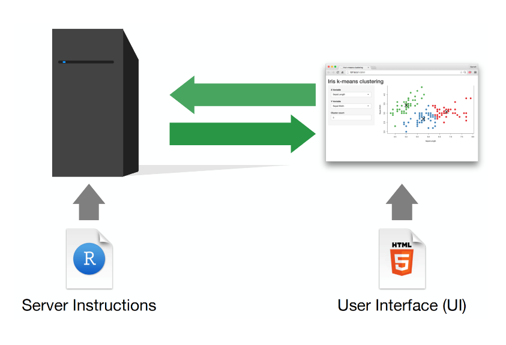 


---

class: inverse, middle


background-image: url("Pozadina.png")
background-position: center
background-size: 96% 97%

#  <span style="color:#a1007a"> ** Template ** </span> 

```r
library(shiny)

# Definiši interfejs i promenljive
ui <- fluidPage()

# Definiši funkciju servera
server <- function(input, output) {}

# Pokreni aplikaciju 
shinyApp(ui = ui, server = server)

```

---

class: inverse, middle


background-image: url("Pozadina.png")
background-position: center
background-size: 96% 97%

#  <span style="color:#a1007a"> ** Pokreni i zaustavi ** </span> 
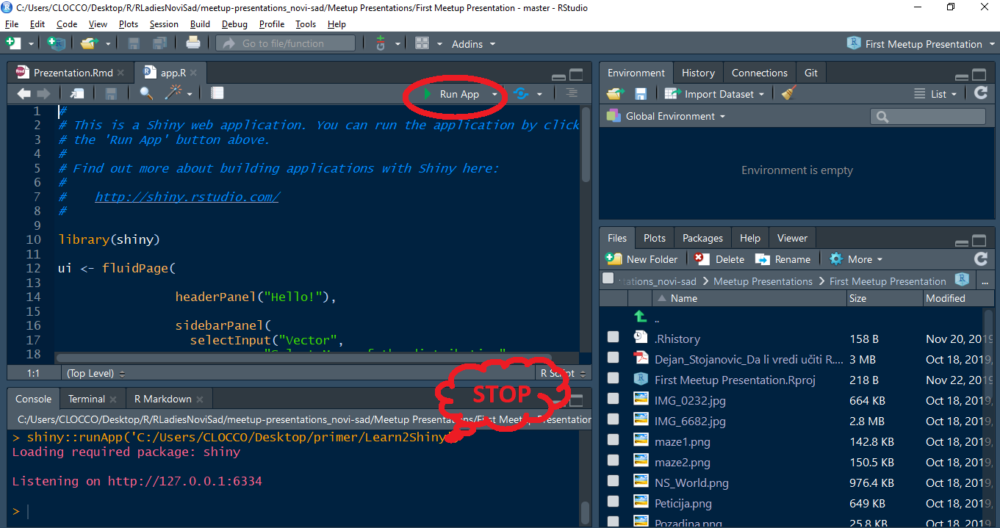 

---

class: inverse, middle


background-image: url("Pozadina.png")
background-position: center
background-size: 96% 97%

#  <span style="color:#a1007a"> ** Naša prava ShinyApp** </span> 
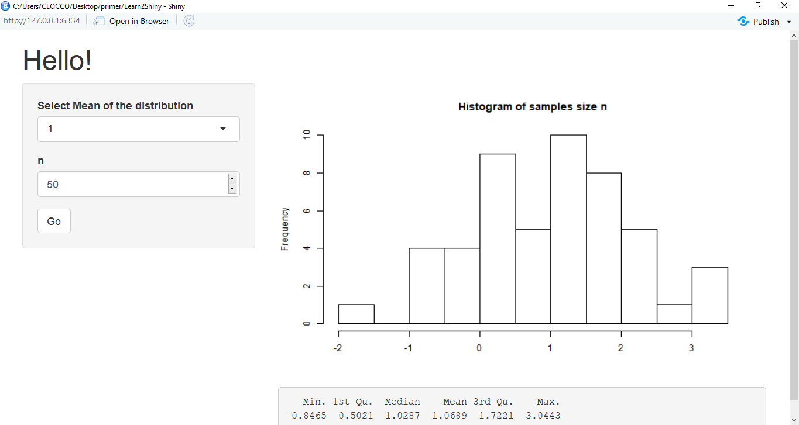 


---

class: inverse, middle


background-image: url("Pozadina.png")
background-position: center
background-size: 96% 97%

#  <span style="color:#a1007a"> ** Sintaksa padajućeg menija ** </span> 

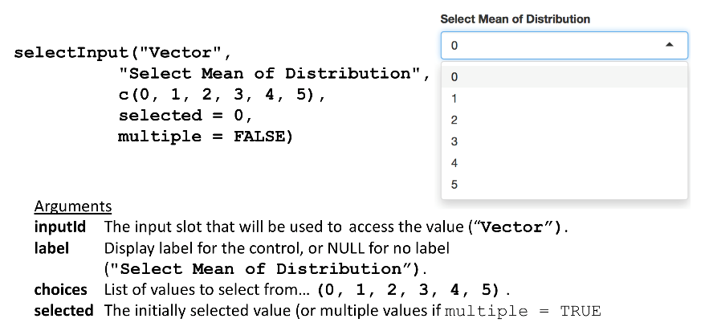 

[<span style="color:#a1007a"> Pogledaj kompletan opis funkcije selectInput](https://shiny.rstudio.com/reference/shiny/latest/selectInput.html) 

---

class: inverse, middle


background-image: url("Pozadina.png")
background-position: center
background-size: 96% 97%

#  <span style="color:#a1007a"> ** Još neke UI funkcije za input objekte** </span> 

 

---

class: inverse, middle


background-image: url("Pozadina.png")
background-position: center
background-size: 96% 97%

#  <span style="color:#a1007a"> ** UI funkcije za output objekte** </span> 

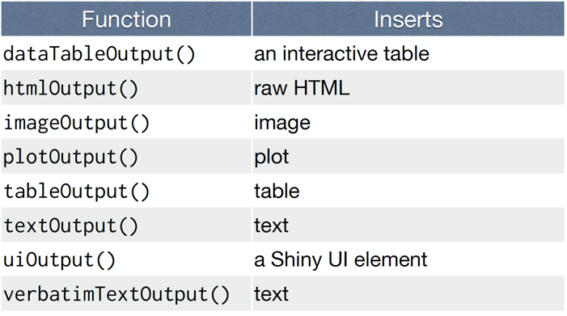 

---

class: inverse, middle


background-image: url("Pozadina.png")
background-position: center
background-size: 96% 97%

#  <span style="color:#a1007a"> ** UI input - output deo ** </span> 

```r

ui <- fluidPage(
  
                # Dodamo naslov
                headerPanel("Hello!"),
                
                # U baru sa strane, u input delu, dodaj 
                sidebarPanel(
                  # Padajuci meni
                  selectInput("Vector", 
                            "Select Mean of the distribution",
                            c(0,1,2,3,4,5),
                            selected = 0,
                            multiple = FALSE),
                  # Vrednost za n
                  numericInput("n", "n", 50),
                  # I dugme Go
                  actionButton("go", "Go")
                
                ),
                
                # U output delu dodaj plot i statistiku
                mainPanel(plotOutput("main_plot"), 
                          verbatimTextOutput("stats"))
)

```

---

class: inverse, middle


background-image: url("Pozadina.png")
background-position: center
background-size: 96% 97%

#  <span style="color:#a1007a"> ** Definisanje input - outputa za server ** </span> 

```r

server <- function(input, output) {
  
  # Kada se aktivira dugme Go sačuvaj mi vrednost promenljive n
  randomVals <- eventReactive(input$go, input$n)
  
  # Kreiraj n, tj. randomVals(), brojeva sa normalnom raspodelom (rnorm)
  # čija je srednja vrednost, mean, sačuvana u vektoru input$Vector
  v <- function() { 
       return(
              rnorm(randomVals(), mean = as.numeric(input$Vector))
  )}
  
  # Kreiran output plot definisan u ui, tako što crtamo histogram 
  # uz pomoć vectora v koji smo upravo definisali
  output$main_plot <- renderPlot(
                      hist(v(), 
                           breaks = 15, # broj stubova
                           xlab = "",   # bez imena na x - osi
                           main = "Histogram of samples size n") # sa naslovom
  )
  
  # Dodaj ispod histograma i opisnu statistiku definisanu u ui
  output$stats <- renderPrint({summary(v())})
}

```

---

class: inverse, middle


background-image: url("Pozadina.png")
background-position: center
background-size: 96% 97%

#  <span style="color:#a1007a"> ** Korisni linkovi ** </span> 

- [<span style="color:#a1007a"> Shiny Rstudio tutorial </span>](https://shiny.rstudio.com/tutorial/)

- [<span style="color:#a1007a"> Traffic Accidents by Tatjana Kecojević </span>](https://tatjana.shinyapps.io/TrafficAccidents/)

- [<span style="color:#a1007a"> Online retail data analysis by Renee Ahel </span>](http://rpubs.com/reneeahel/OnlineRetailAnalysisDemo)

- [<span style="color:#a1007a"> Cancer Research UK Cambridge Institute </span>](https://www.cruk.cam.ac.uk/core-facilities/bioinformatics-core/shiny-apps)

- [<span style="color:#a1007a"> GALLERY OF R WEB APPS </span>](https://www.showmeshiny.com)

- [<span style="color:#a1007a"> package::xaringan </span>](https://bookdown.org/yihui/rmarkdown/xaringan.html)


---


class: inverse, middle, center

background-image: url("Pozadina.png")
background-position: center
background-size: 96% 97%

# <span style="color:#a1007a"> ** Thanks for listening :) ** </span>

# <span style="color:#a1007a"> ** Follow R - Ladies Novi Sad on ** </span>
### [<span style="color:#a1007a"> Twitter: R - Ladies Novi Sad </span>](https://twitter.com/RLadiesNoviSad?s=03)      
### [<span style="color:#a1007a"> Meetup: R - Ladies Novi Sad </span>](https://www.meetup.com/rladies-novi-sad/)
### [<span style="color:#a1007a"> GitHub rladies </span>](https://github.com/rladies/meetup-presentations_novi-sad)
# <span style="color:#a1007a"> ** Contact R - Ladies Novi Sad ** </span>
## <span style="color:#a1007a"> **novisad@rladies.org** </span>     
## <span style="color:#a1007a"> Let us build projects together!</span>


<!-- I to bi bilo to! -->
<!-- Cestitamo! Savladali smo svi zajedno kako praviti prezentaciju u R-u. -->
<!-- Ovaj Tamplate slobodno mozete koristiri za VASU PRVU R PREZENTACIJU. -->
<!-- PUNO SRECE U UCENJU R-a ZELE TI R-LADIES NOVI SAD!-->
