class: inverse, middle


background-image: url("rladies-wide-logo.png")
background-position: top right
background-size: 15% 10%

<!-- Tri crtice --- su pocetak slajda
A iznad njih su redom naslov, podnaslov, 
autor, datum, paket koji je koriscen i 
koji css fajlovi.-->

<!-- Zatim su postavljene
osobine slajda, tj. definisemo njegovu 
klasu koju posle mozemo menjati, tj. 
definisati unutar odgovarajuceg css fajla.-->


<!-- Nakon klase definisana je pozadina slajda.-->


#  <span style="color:pink"> ** Meet the Team ** </span>

<!-- # koristimo da stavimo doznanja R -u da je u pitanju naslov.
Ukoliko koristimo vise # kao sto je to ispit uradjeno, teks
ce biti manji.-->

<!-- Komanda <span style="color:deeppink"> tekst </span> koristi se 
za menjanje boje teksta, u ovom slucaju boja iz R spektra 
je deeppink.-->

<!-- **tekst** Dve zvezdice ispred i nakon teksta koristimo da 
 potamnimo tekst, tj. za opciju bold. -->


.pull-left[
- ### Tatjana Kecojevic
- ### Maja Pokusevski     
- ### Milena Kresoja 
- ### Katica Ristic
- ### Ranka Medenica Todorovic
- ### Olivera Grljevic
]

<!-- Komanda .pull-left[] i .pull-right[]
koristimo da prostor slajda podeli u dve kolone.
-->
<!-- Komanda jedna crtica sluzi da bi se oznacila
teza -->


.pull-right[

]

<!-- Ukoliko zelite da ubacite sliku/animacije koja nije pozadina 
to mozete uraditi komandom 
pri cemu mozete odrediti mesto prikazivanja slike, kao i njenu visinu/velicinu
-->

---

class: inverse, middle


background-image: url("Pozadina.png")
background-position: center
background-size: 96% 97%

# <span style="color:#a1007a"> ** We are a part of ** </span>    
# <span style="color:#a1007a"> ** R - Ladies Global ** </span>
---

class: inverse, middle


background-image: url("Pozadina.png")
background-position: center
background-size: 96% 97%

.pull-left[

]

.pull-right[
##<span style="color:#a1007a"> Worldwide organisation that promotes gender diversity in the R community via meetups and mentorship in friendly and safe environment. </span>
]          

---
class: inverse, middle


background-image: url("Pozadina.png")
background-position: center
background-size: 96% 97%

# <span style="color:#a1007a">  We're a part of it!  </span> 


---
class: inverse, middle


background-image: url("Pozadina.png")
background-position: center
background-size: 96% 97%

.pull-left[


<span style="color:#a1007a"> - R-Ladies Global, designed to improve the gender diversity of R users worldwide and in particular, to improve the participation and experience of women in the R community.</span>
]

.pull-right[


<span style="color:#a1007a">- **R-Ladies Novi Sad** will host a number of talks and workshops about the use of R. It doesn't matter if you never used R or if you are an R expert, **R-Ladies Novi Sad** welcomes anyone with an interest in R.</span> 

<span style="color:#a1007a">- The goal is to promote R, exchange knowledge and create an R community among women.</span> 

<span style="color:#a1007a">- We are fully inclusive and respectful of LGBT identities - our priority is to provide a safe community space for anyone identifying as female who is interested in and/or working with R.</span>
]


---

class: inverse, middle, center


background-image: url("rladies-wide-logo.png")
background-position: top right
background-size: 15% 10%


#  <span style="color:pink"> ** Osnove programiranja u R-u Part I ** </span> 


##  <span style="color:white">  Ranka Medenica Todorovic  </span>


---


class: inverse, middle

background-image: url("rladies-wide-logo.png")
background-position: top right
background-size: 15% 10%


#  <span style="color:pink"> Sta je **R**? </span>

- **free open source programski jezik** - otvoreni (besplatan) softver otvorenog koda, sto znaci da je njegov izvorni kod dostupan svim korisnicima, koji ga mogu menjati, prepravljati i poboljsavati njegov sadrzaj - sto nije slucaj sa placenim sotverima

- belezi dramatican rast proteklih godina

- u 2019. godini zauzima 5. mesto na IEEE rang listi top programskih jezika [ IEEE - *Institute of Electrical and Electronics Engineers* - najvece svetsko udruzenje inzenjera elektrotehnike  ](https://spectrum.ieee.org/static/interactive-the-top-programming-languages-2019)

- **programski jezik za statisticku analizu i graficki prikaz podataka** (i jos mnogo toga) - popularan i u drugim naucnim poljima: *machine learning*, *data science* i drugim prediktivnim tehnikama i analizama podataka


 - objedinjuje  funkcije komercijalnih statistickih programa (Statistica, Excel, SPSS) i programskih jezika (C, Pascal) 


- koriste ga najvece IT i high tech kompanije kao sto su Misrosoft, Google, Facebook, Twitter, Amazon, LinkedIn, itd.


---

class: inverse, middle

background-image: url("rladies-wide-logo.png")
background-position: top right
background-size: 15% 10%


#  <span style="color:pink"> Kako je nastao **R**? </span>

- nastao kao open-source implementacija (implementacija otvorenog koda) programskog jezika S 

- pocetkom 90-ih dva profesora, **R**oss Ihaka i **R**obert Gentleman, sa Departmana za statistiku Univerzitetu u Oklandu (Novi Zeland) poceli su sa razvojem novog jezika za statisticku i analiticku obradu podataka (u to vreme nedostajalo je programa u kojima se na brz i jednostavan nacin moglo doci do vaznih informacija o podacima)

- **1995. godine zvanicno je objavljen R programski jezik kao open source projekat sa GNU licencom za slobodni softver - [GNU General Public Licence](http://www.gnu.org/licenses/gpl-2.0.html) i postao je dostupan korisnicima razlicitih operativnih sistema**

- nakon 1997. godine formira se **R Development Core Team** koji cini veca grupa statisticara, i u okviru koje se i danas razvija R


---


class: inverse, middle

background-image: url("rladies-wide-logo.png")
background-position: top right
background-size: 15% 10%


#  <span style="color:pink"> Preuzimanje i instaliranje **R**-a </span>

Instaliranje R-a sa CRAN mreze: <https://cran.r-project.org/>
(dostupan za Linux, Windows i MacOS)

CRAN: Comprehensive R Archive Network
  - distributivna mreza **R**-a i repozitorijuma paketa;
    - paketi - brojni dodaci osnovnog R jezika dostupni preko CRAN mreze;
    - kroz njih se prosiruju mogucnosti R-a i pruza dodatna funkcionalnost;
    - razvijaju ih sami korisnici - trenutno je dostupno 14977 paketa u okviru CRAN repoziturijuma.

R programski jezik moze se koristiti kroz R konzolu (pokretanjem samog programa) ili u nekom od integrisanih razvojnih okruzenja (*Integrated Development Environment* - IDE)

RStudio je najpopularnije integrisano okruzenje za R (free, open-source) <https://www.rstudio.com/>

Pokretanjem R-a automatski ce biti instalirani osnovni paketi sa standardnim funkcijama.

---

class: inverse, middle


background-image: url("rladies-wide-logo.png")
background-position: top right
background-size: 15% 10%

<https://cran.r-project.org/>
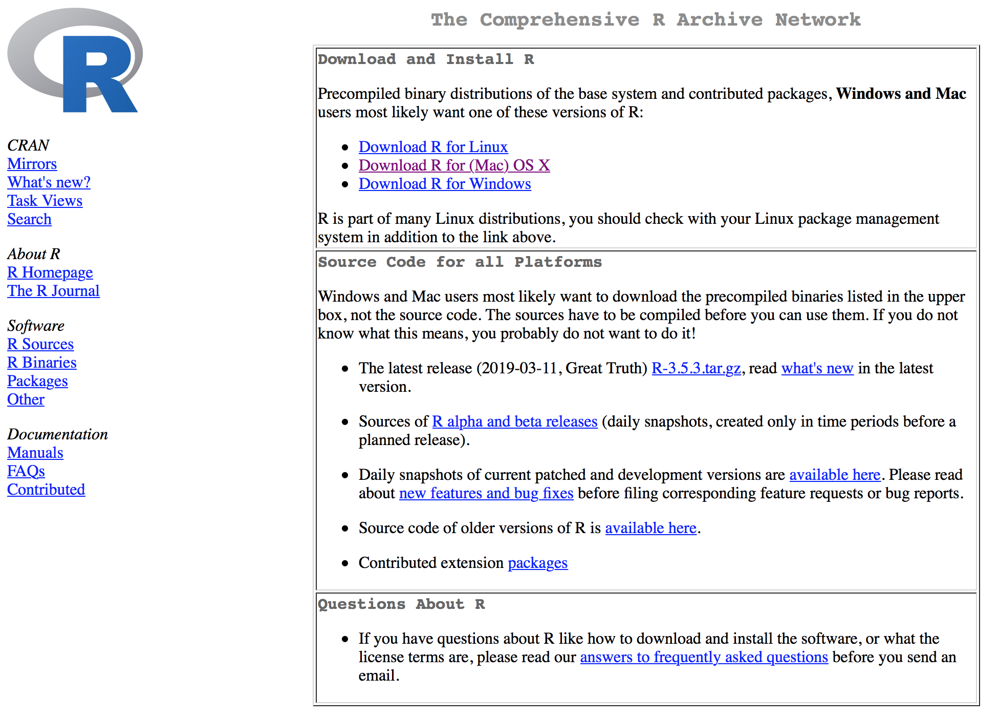


---


class: inverse, middle


background-image: url("rladies-wide-logo.png")
background-position: top right
background-size: 15% 10%

<https://www.rstudio.com/>
RStudio okruzenje sadrzi nekoliko prozora

.pull-left[<span style="color:pink"> **Console** </span> - konzola - prozor koji prikazuje rezultate Vasih komandi i vrednosti varijabli; prikazuje sta se desava nakon izvrsenog koda.]
.pull-right[<span style="color:pink"> **Environment** </span> - podaci na kojima trenutno radite - polje je na pocetku prazno jer jos uvek nisu ucitani podaci)]
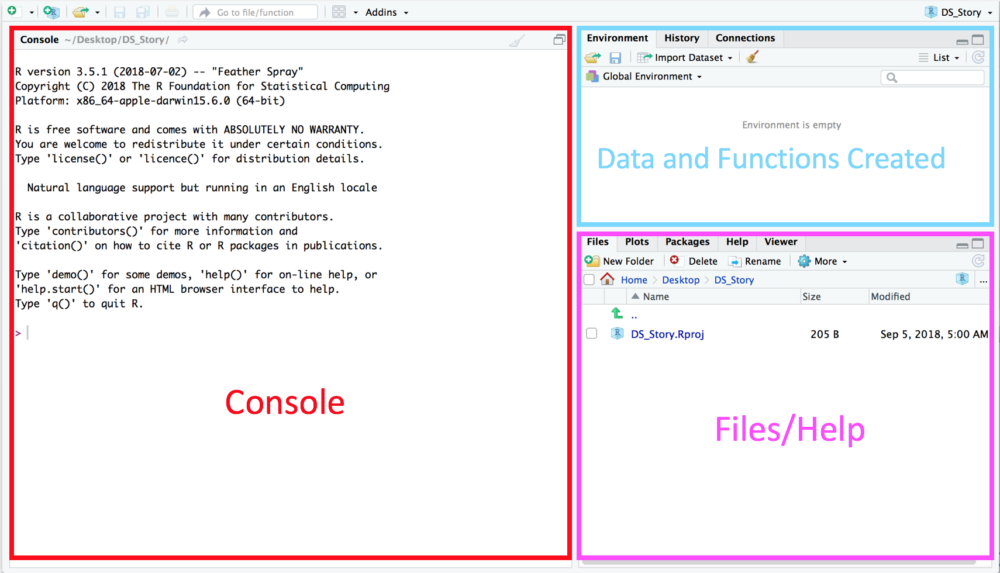
<span style="color:pink"> **Files** </span> - prikazuje fajlove u okviru radnog direktorijuma / <span style="color:pink"> **Packages** </span> - prikazuje sve eksterne R pakete koji su instaliran na vasem lokalnom sistemu; treba da budu cekirani da bi mogli da se koriste; klikom na Packages/Install Packages instaliraju se paketi

---

class: inverse, middle


background-image: url("rladies-wide-logo.png")
background-position: top right
background-size: 15% 10%

Pored navedenih, posebnu vaznost ima 4. (odnosno 1. &#9786;) prozor za pisanje R skripti - **Source** (izvorni kod) koji ce se nalaziti u gornjem levom uglu. Pre nego sto otvorimo prozor za kreiranje i cuvanje skripte, potrebno je kreirati novi projekat i uspostaviti radni direktorijum.

#  <span style="color:pink"> Postavljanje radnog direktorijuma </span>

Svaki projekat na kom radite u R-u ima drugacije radne skripte i fajlove. Sve sto je vezano za dati projekat neophodno je cuvati u jednom direktorijumu - folderu.

.pull-left[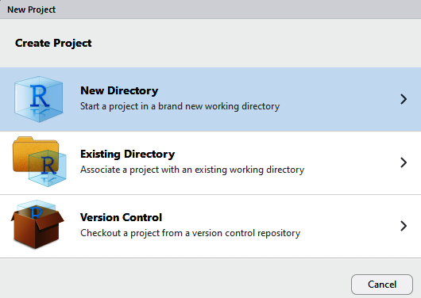]

.pull-right[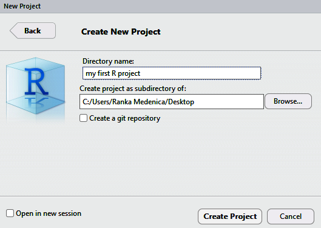]


---


class: inverse, middle


background-image: url("rladies-wide-logo.png")
background-position: top right
background-size: 15% 10%


#  <span style="color:pink"> Kreiranje nove radne skripte </span>

Da bi sacuvali zeljeni rezultat koda, kao i kontinuitet u projektu, potrebno je kod sacuvati kao skriptu (fajl sa ekstenzijom .R)

.pull-left[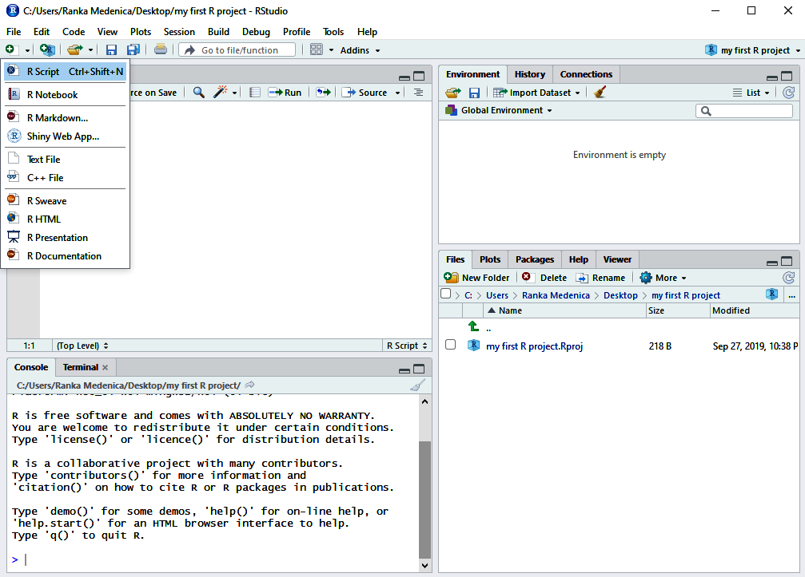]

.pull-right[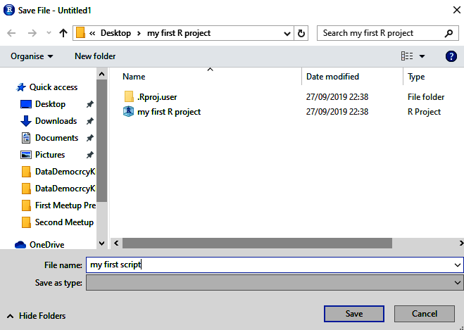]


.pull-left[Sada imate svoj prvi projekat u R-u i prvu radnu skriptu! &#9787; &#9733; &#9786]

---

class: inverse, middle


background-image: url("rladies-wide-logo.png")
background-position: top right
background-size: 15% 10%

#  <span style="color:pink"> Osnovne funkcije - racunajmo u R-u! </span>

Operatori su simboli koji upucuju program da izvrsi odredene matematicke ili logicke operatcije.

.pull-left[aritmeticki operatori]

.pull-right[logicki operatori]

.pull-left[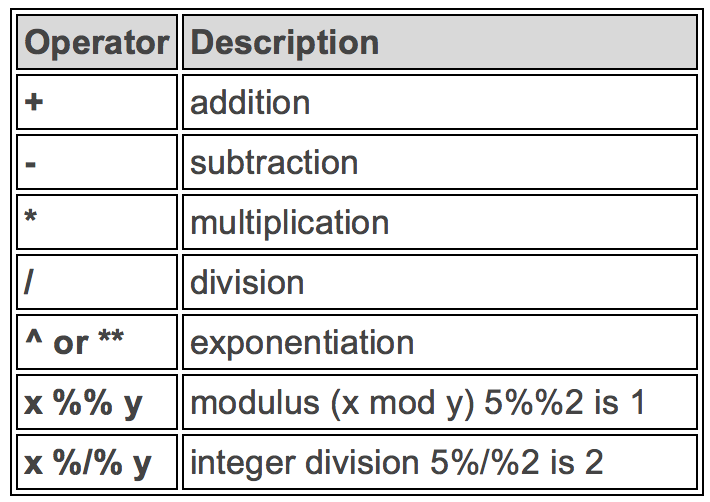]

.pull-right[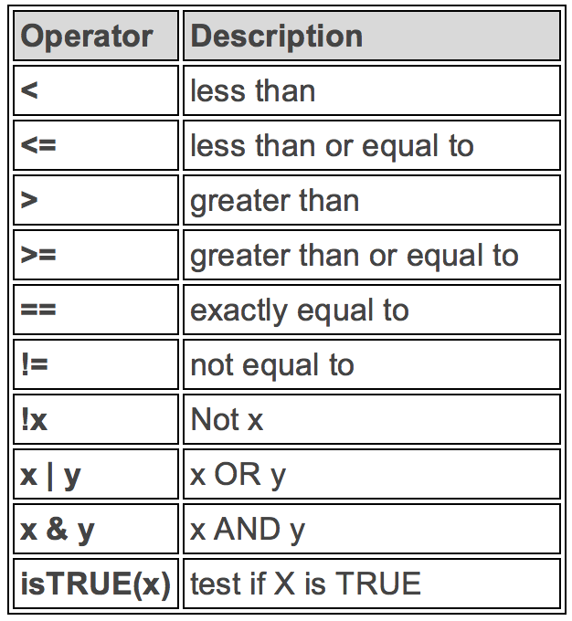]


---


class: inverse, middle


background-image: url("rladies-wide-logo.png")
background-position: top right
background-size: 15% 10%

.pull-left[Svaki kod koji se zapise u skriptu, moze da se izvrsi u konzoli. Opcija **Run** na vrhu skripte izvrsice liniju koda na kojoj se nalazi kursor. Da bi se pokrenulo vise linija koda potrebno ih je sve oznaciti.]

.pull-right[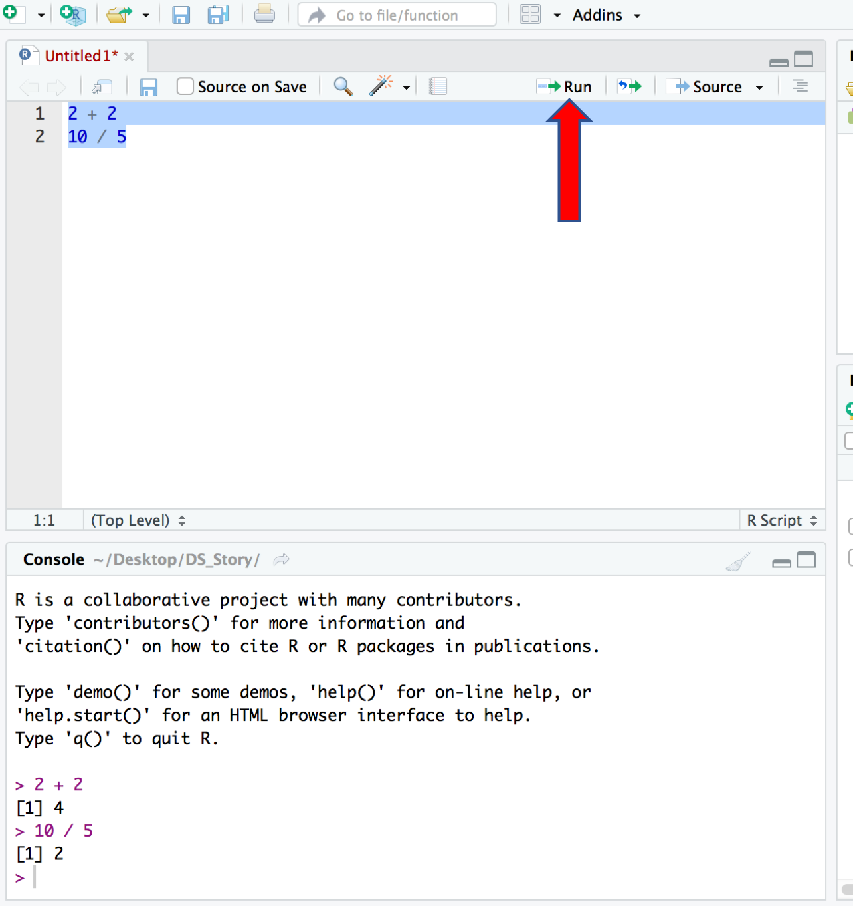]

---

class: inverse, middle


background-image: url("rladies-wide-logo.png")
background-position: top right
background-size: 15% 10%

#  <span style="color:pink"> ** RStudio & Github ** </span>

 Radom na projektima u R-u generise se veliki broj datoteka kojima treba upravljati i dati im neku strukturu. Cesto bi Vas rad mogao imati koristi od saradnje sa drugima, pa je potrebno uciniti ga dostupnim za citanje i izmene u toku samog razvoja projekta. Git je alat, free, open sorce sistem kontrole koji omogucava pracenje i deljenje koda, promene na vasim fajlovima i analize. Git konfigurise i organizuje setove fajlova koje generisete i koristite. Ti setovi nazivaju se repozitorijumi.
 
 **GitHub** predstavlja web servis koji omogucava skladistenje Vasih repozitorijuma.

Na nasoj GitHub stranici mozete skinuti danasnju prezentaciju, kao i prezentaciju sa prvog Meetup-a i sve naredne.
<https://github.com/rladies/meetup-presentations_novi-sad>
Kada se stranica otvori, kliknite na zeleno dugme **Clone or download** i odaberite opciju Download ZIP, ovaj fajl cete unzip-ovati na Vasem kompjuteru.


---

class: inverse, middle


background-image: url("rladies-wide-logo.png")
background-position: top right
background-size: 15% 10%


---

class: inverse, middle


background-image: url("rladies-wide-logo.png")
background-position: top right
background-size: 15% 10%

Prateci putanju C:\...\Downloads\meetup-presentations_novi-sad\Meetup Presentations\Second Meetup Presentation
doci cete do fajla TemplatePrezentation2**.Rmd**, pokrenite ga. Fajl ce se otvoriti u RStudio-u.

Uz pomoc dugmeta **Knit** pokrenite prezentaciju. Posto nemate odgovarajuce pakete instalirane, RStudio ce se sam ponuditi da ih instalira za Vas. Pored toga cete ipak morati sami da instalirate xaringan paket. U desnoj polovini prozora imate dugme **Install**, na koje kada kliknete otvara se mali prozor kao na slici, a zatim ukucajte ime paketa i kliknite opet na dugme Install. Nakon instalacije svih paketa, trebalo bi da pritiskom na dugme Knit Vas RStudio otvori nasu prezentaciju.

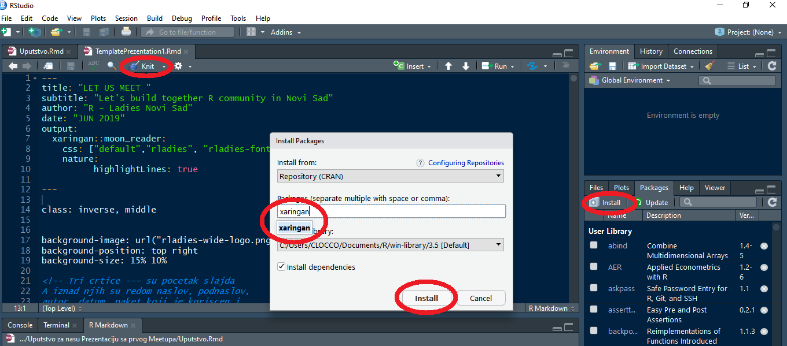

---

class: inverse, middle


background-image: url("Pozadina.png")
background-position: center
background-size: 96% 97%

#  <span style="color:#a1007a"> ** Osnove programiranja u R-u Part II** </span> 


##  <span style="color:#0000cd">  Maja Pokusevski  </span>

---

class: inverse, middle


background-image: url("Pozadina.png")
background-position: center
background-size: 96% 97%

# <span style="color:#a1007a"> ** Varijable ** </span>  

 <span style="color:#0000cd"> - **Obelezje** </span> <span style="color:#a1007a">, varijabla, promenljiva: nesto cije vrednosti variraju </span>

 <span style="color:#0000cd"> - **Podaci** </span> <span style="color:#a1007a"> su vrednosti merenja promenljivih </span>

 <span style="color:#0000cd"> - **Starost** </span> <span style="color:#a1007a"> pacijenta je </span> <span style="color:#0000cd">**35 godina** </span>.


---

class: inverse, middle


background-image: url("Pozadina.png")
background-position: center
background-size: 96% 97%

# <span style="color:#a1007a"> ** Merne skale ** </span>  


<span style="color:#0000cd"> 1. ** Nominalna ** </span> <span style="color:#a1007a">- svojstvo identifikacije, opisna uloga, nema numericke vrednosti</span> 
 
<span style="color:#0000cd"> 2.  ** Ordinalna **</span> <span style="color:#a1007a"> - ima dva svojstva: identitet i velicinu, vrednost u rednoj skali ima jedinstveno znacenje i ureden odnos prema svakoj drugoj vrednosti </span>

<span style="color:#0000cd"> 3. ** Intervalna ** </span> <span style="color:#a1007a"> - ima svojstva: identitet, velicinu i jednake intervale </span>

<span style="color:#0000cd"> 4. ** Racio ** </span> <span style="color:#a1007a"> - poseduje sva cetiri svojstva merenja: identitet, velicinu, jednake intervale i apsolutnu nulu </span>     
 
<span style="color:#a1007a"> Jos neki nivoi merenja: Log-intervalni, aditivni, apsolutni </span>


---

class: inverse, middle


background-image: url("Pozadina.png")
background-position: center
background-size: 96% 97%

# <span style="color:#a1007a"> ** Tipovi varijabli - podele, podele, podele ** </span>  


<span style="color:#0000cd"> ** PREMA PRIRODI MERENJA ** </span> 
 
<span style="color:#a1007a"> - Kvantitativne     
<span style="color:#a1007a"> - Kvalitativne
</span> 
 
<span style="color:#0000cd"> ** PREMA NUMERICKOJ VREDNOSTI **</span> 

<span style="color:#a1007a"> - Numericke   
<span style="color:#a1007a"> - Kategorijalne   
</span>

<span style="color:#0000cd"> ** PREMA ULOZI U ISTRAZIVANJU (metodoloski) ** </span> 

<span style="color:#a1007a"> - Zavisne   
<span style="color:#a1007a"> - Nezavisne    
<span style="color:#a1007a"> - Kontrolne, moderatorske, medijatorske    
<span style="color:#a1007a"> - Kriterijumske i prediktorske    
</span>


<span style="color:#0000cd"> ** PREMA SKALI MERENJA ** </span> 

<span style="color:#a1007a"> - Nominalne     
<span style="color:#a1007a"> - Orinalne     
<span style="color:#a1007a"> - Intervalne     
<span style="color:#a1007a"> - Racio    
</span>     


---

class: inverse, middle


background-image: url("Pozadina.png")
background-position: center
background-size: 96% 97%

# <span style="color:#a1007a"> ** Nominalni nivo - primeri ** </span>   

<span style="color:#0000cd"> - podaci nemaju jedinicu mere, redosled mogucih kategorija je potpuno proizvoljan

<span style="color:#a1007a"> - boja ociju     
<span style="color:#a1007a"> - postanski broj     
<span style="color:#a1007a"> - vrsta reci (imenica, zamenica, pridev, glagol, predlog, . . . )    

<span style="color:#a1007a"> ...
</span>


---

class: inverse, middle


background-image: url("Pozadina.png")
background-position: center
background-size: 96% 97%

# <span style="color:#a1007a"> ** Ordinalni nivo - primeri ** </span>   

<span style="color:#0000cd"> - podaci nemaju jedinicu mere, redosled mogucih kategorija nije proizvoljan, poznato je koja kategorija prehodi drugoj, oznacava redosled


<span style="color:#a1007a"> - radno iskustvo (0 do 5 godina, 6 do 10 godina, 11 do 15 godina, preko 15 godina)    
<span style="color:#a1007a"> - pozicija na ATP listi     
<span style="color:#a1007a"> - izbor za mis    

<span style="color:#a1007a"> ...
</span>


---

class: inverse, middle


background-image: url("Pozadina.png")
background-position: center
background-size: 96% 97%

# <span style="color:#a1007a"> ** Intervalni nivo - primeri ** </span>   

<span style="color:#0000cd"> - podaci imaju jedinicu mere,  pokazuje i redosled i apsolutne razlike, poznat interval izmedu jedinica (jednak) , nemaju apsolutnu nulu tj nula je proizvoljno odredena


<span style="color:#a1007a"> - standardizovani IQ testovi    
<span style="color:#a1007a"> - temperatura u Celzijusima ili Farenhajtima    
</span>


---

class: inverse, middle


background-image: url("Pozadina.png")
background-position: center
background-size: 96% 97%

# <span style="color:#a1007a"> ** Racio nivo - primeri ** </span>   

<span style="color:#0000cd"> - skala odnosa, numericki podaci


<span style="color:#a1007a"> - visina u cm, m   
<span style="color:#a1007a"> - tezina u g, kg   
<span style="color:#a1007a"> - duzina u m, km      
</span>

---
class: inverse, middle


background-image: url("Pozadina.png")
background-position: center
background-size: 96% 97%


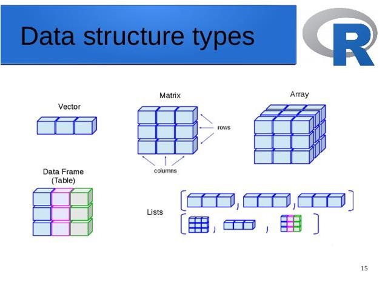


---
class: inverse, middle


background-image: url("Pozadina.png")
background-position: center
background-size: 96% 97%


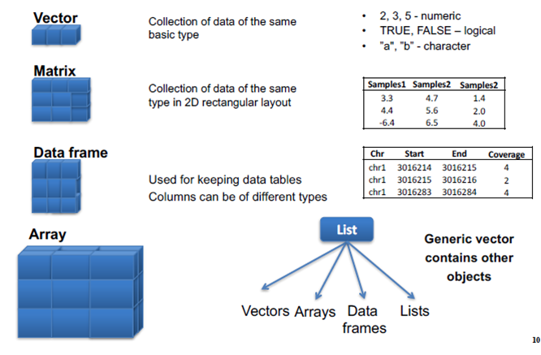


---

class: inverse, middle


background-image: url("Pozadina.png")
background-position: center
background-size: 96% 97%

# <span style="color:#a1007a"> ** Vektori ** </span>   

<span style="color:#a1007a"> Osnovni tip podataka u R-u    
<span style="color:#a1007a"> Niz od vise elemenata (komponenti) istog tipa    
<span style="color:#a1007a"> Moze biti sastavljen od brojeva, vrednosti logickih operatora (TRUE/FALSE) ili karaktera (tekstualnih promenljivih)
</span>

<span style="color:#0000cd"> ** Kreiranje vektora  `c()` **

```r
numeric_vector <- c(12, 45.3, -23, 0, 0.001)
character_vector <- c("Beograd", "Pariz", "Rim", 45)
log_vector <- c(TRUE, TRUE, FALSE, TRUE, FALSE)
```

---

class: inverse, middle


background-image: url("Pozadina.png")
background-position: center
background-size: 96% 97%

# <span style="color:#a1007a"> ** Tipovi vektora ** </span>   

<span style="color:#a1007a"> 1. Numericki: `c(1, 2, 0.7) `      
<span style="color:#a1007a"> 2. Karakteri: `c("hello"); c("Dobrodosli")`      
<span style="color:#a1007a"> 3. Logicki: `TRUE` ili `FALSE` vrednosti    
<span style="color:#a1007a"> 4. Faktori    
</span>


```r

diabetes <- c("Tip1", "Tip2", "Tip1", "Tip1")
diabetes <- factor(diabetes)
status <- c("Los", "Dobar", "Odlican", "Los")
status <- factor(status, ordered = TRUE)
status <- factor(status, order = TRUE, levels = c("Los", "Dobar", "Odlican"))

```

---

class: inverse, middle


background-image: url("Pozadina.png")
background-position: center
background-size: 96% 97%

# <span style="color:#a1007a"> ** Funkcije ** </span>   


```r

sum(numeric_vector)
sum(character_vector)  # Da li mozemo da sumiramo karaktere?
sum(log_vector)        # Funkcionise zato sto R posmatra FALSE kao 0, TRUE kao 1
length(numeric_vector)
sort(numeric_vector)


```
<span style="color:#a1007a"> Sabiranje 2 vektora `c(1,2,3) + c(4,5,6) `


---

class: inverse, middle


background-image: url("Pozadina.png")
background-position: center
background-size: 96% 97%

# <span style="color:#a1007a"> ** Selekcija i ekstrakcija elemenata vektora ** </span>   


```r

numeric_vector[2]                   # Izbor drugog elementa vektora
numeric_vector[-2]                  # Izbor svih osim drugog elementa vektora
numeric_vector[3:5]                 # Izbor od treceg do petog  elementa vektor
numeric_vector[numeric_vector > 6]  # Izbor svih elementa vektora vecih od 6


```

---

class: inverse, middle


background-image: url("Pozadina.png")
background-position: center
background-size: 96% 97%

# <span style="color:#a1007a"> ** Matrice ** </span>   

<span style="color:#a1007a"> Vektori imaju jednu dimenziju, dok matrice imaju 2 dimenzije (redove i kolone)
</span>

<span style="color:#0000cd"> ** Kreiranje matrice `matrix()` **

```r
matrix(1:9, byrow=TRUE, nrow=3)

```
<span style="color:#a1007a"> Sve operacije i funkcije koje vaze za vektore, vaze i za matrice

---

class: inverse, middle


background-image: url("Pozadina.png")
background-position: center
background-size: 96% 97%

# <span style="color:#a1007a"> ** Faktori  ** </span>   


<span style="color:#0000cd"> ** Kreiranje faktora `factor()` **


# <span style="color:#a1007a"> ** Liste ** </span>   


<span style="color:#0000cd"> ** Kreireanje liste `list()` **


<span style="color:#a1007a"> Argumenti u funkciji `list()` su komponente koje mogu biti matrice, vektori, data frame, druge liste. Nije obavezno da komponente liste budu povezane


---

class: inverse, middle


background-image: url("Pozadina.png")
background-position: center
background-size: 96% 97%

# <span style="color:#a1007a"> ** Data Frame ** </span>   


<span style="color:#a1007a"> Tabele su verovatno najbitniji i najcesci tip podataka u R-u. Format `data.frame` je najslicniji tabelama koje srecemo u programima kao sto su **Excel**, **Statistica**, **SPSS** ili **SAS**.

## <span style="color:#a1007a"> ** Kreiranje ** </span>

<span style="color:#a1007a"> Tabele u R-u mozemo kreirati na vise nacina: spajanjem vise vektora, ekstrakcijom podataka iz postojece tabele, ucitavanjem tabele iz drugog formata, pretvaranjem nekog drugog formata u data.frame, itd.

<span style="color:#0000cd"> ** Kreiranje data frame `data.frame()` **


---

class: inverse, middle


background-image: url("Pozadina.png")
background-position: center
background-size: 96% 97%

# <span style="color:#a1007a"> ** Nasi Podaci ** </span>   


```r
polBaseValues <- c(1, 1, 1, 2, 2, 1, 1, 2, 2, 2, 2, 1, 1, 1)
polFactor <- factor(polBaseValues,
                    levels=c(1, 2),
                    labels=c("M", "Z"))
                    

godine <- c(22, 69, 64, 44, 31, 38, 60, 50, 65, 21, 48, 26, 47, 36)


obrazovanje3 <- factor(c(1, 3, 3, 2, 3, 2, 1, 1, 1, 2, 1, 1, 3, 3),
                       levels=c(1, 2, 3),
                       labels=c("Osnovna", "Srednja", "Visoka i visa"))
        
rbr <- 1:14

ls()
rm()

```

---

class: inverse, middle


background-image: url("Pozadina.png")
background-position: center
background-size: 96% 97%

# <span style="color:#a1007a"> ** Nasi Podaci ** </span>   


```r
nasiPodaci <- data.frame(rbr, polFactor, godine, obrazovanje3)

summary(nasiPodaci) # sumiranje podataka

ncol(nasiPodaci)    # broj kolona
nrow(nasiPodaci)    # broj vrsta
head(nasiPodaci)    # prikazuje prvih 6 vrsta
tail(nasiPodaci)    # prikazuje poslednjih 6 vrsta

str(nasiPodaci)     # Struktura data frame


```
---

class: inverse, middle


background-image: url("Pozadina.png")
background-position: center
background-size: 96% 97%

# <span style="color:#a1007a"> ** Nasi Podaci ** </span>   


```r
nasiPodaci[1,1]               # element u prvoj koloni i prvom redu
nasiPodaci[,1]                # prva kolona
nasiPodaci[,2:4]              # kolone 2 - 4
nasiPodaci[,"obrazovanje3"]   # samo kolona obrazovanje3
nasiPodaci[,-3]               # sve osim kolone broj 3
nasiPodaci[,c(-1, -3)]        # sve osim kolona 1 i 3
nasiPodaci[1:10,]             # slucajevi 1 - 10
nasiPodaci$godine

names(nasiPodaci) <- c("ID", "Pol", "Godine", "Obrazovanje")
colnames(nasiPodaci)

ageIdx <- nasiPodaci$Godine < 30 # indikator mladjih od 30 godina
ageIdx


```

---

class: inverse, middle


background-image: url("Pozadina.png")
background-position: center
background-size: 96% 97%

# <span style="color:#a1007a"> ** Recoding ** </span>   


```r
godine_test <- c(51, 46, 24, 60, 25, 58, 39, 35, 61, 58, 32, 59, 27, 
                 46, 62, 52, 65, 45, 29, 55, 23, 28, 20, 58, 42, 50, 
                 61, 32, 33, 44, 64, 61, 21, 32, 61, 49, 25, 24, 46, 
                 33, 54, 30, 41, 26, 38, 37, 22, 44, 41, 24)

godine3 <- cut(godine_test, 
               breaks = 3, 
               labels = c("ispod 30", "31-50", "preko 50"))
godine6 <- cut(godine_test, 
               breaks = c(0, 20, 30, 40, 50, 60, 100))
dta.test <- data.frame(godine_test, godine3, godine6)


```


---

class: inverse, middle


background-image: url("Pozadina.png")
background-position: center
background-size: 96% 97%

# <span style="color:#a1007a"> ** Nedostajuci podaci - Missing values ** </span>   


```r

y <- c(1, 2, 3, NA, 5, 6, NA, 3, 2)
is.na(y)

mean(y)   # sta se dobije?
mean(y, na.rm = TRUE) 

```
---

class: inverse, middle


background-image: url("Pozadina.png")
background-position: center
background-size: 96% 97%

# <span style="color:#a1007a"> ** Ucitavanje podataka - Import data ** </span>   
<span style="color:#a1007a"> Import TEXT DATA </span>

```r 
mydataframe <- read.table(file,header=logical_value,
                               sep="delimiter",row.names="name")

```

```r

dfText <- read.table("titanic3.txt", header=TRUE, sep="\t")

```
<span style="color:#a1007a"> Import EXCEL DATA </span>


```r

install.packages("readxl")
library(readxl)

dfExcel <- read_excel("titanic3.xls")

```
<span style="color:#a1007a"> Import SPSS DATA </span>

```r

library(foreign)      # load the foreign package
help(read.spss)       # documentation
mydata <- read.spss("myfile", to.data.frame=TRUE)

```
<span style="color:#a1007a"> Import URL DATA </span>

---

class: inverse, middle


background-image: url("Pozadina.png")
background-position: center
background-size: 96% 97%

# <span style="color:#a1007a"> ** VEZBA ** </span>   


<span style="color:#a1007a"> Kreirajte  vektore:

<span style="color:#a1007a"> Ime planete: Merkur, Venera, Zemlja, Mars, Jupiter, Saturn, Uran, Neptun

<span style="color:#a1007a"> Tip planete : Terra (Terrestrial - kamen) : Merkur, Venera, Zemlja, Mars,  i Gas (Gas Giant - gasovita ) : Jupiter, Saturn, Uran, Neptun

<span style="color:#a1007a"> Precnik : Merkur( 0.382), Venera (0.949), Zemlja ( 1), Mars ( 0.532), Jupiter ( 11.209), Saturn ( 9.449), Uran ( 4.007), Neptun ( 3.883)

<span style="color:#a1007a"> Rotacija : Merkur( 58.64), Venera ( -243.02), Zemlja ( 1), Mars ( 1.03), Jupiter ( 0.41), Saturn ( 0.43), Uran ( -0.72), Neptun ( 0.67) 

<span style="color:#a1007a"> Prsten - da li planeta ima prsten  ili ne: IMA PRSTEN : Jupiter, Saturn, Uran, Neptun,  ostale nemaju prsten 
</span>

<span style="color:#a1007a"> Kreirajte DATA FRAME i nazovite ga Suncev sistem, koji ce da se sastoji od svih napravljenih vektora </span>


---
class: inverse, middle


background-image: url("Pozadina.png")
background-position: center
background-size: 96% 97%

# <span style="color:#a1007a"> ** Dodatak: Swirl ** </span>


##  <span style="color:#0000cd">  Katica Ristic  </span>


---
class: inverse, middle


background-image: url("Pozadina.png")
background-position: center
background-size: 96% 97%


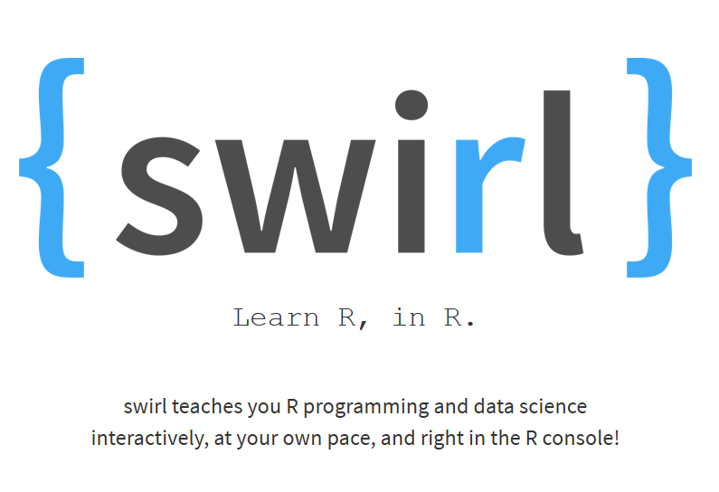


---
class: inverse, middle


background-image: url("Pozadina.png")
background-position: center
background-size: 96% 97%

# <span style="color:#a1007a"> ** Instalacija Swirl paketa ** </span>

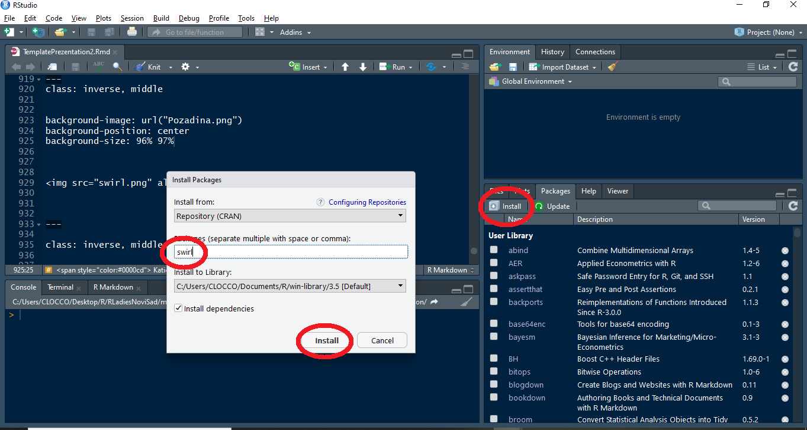


---
class: inverse, middle


background-image: url("Pozadina.png")
background-position: center
background-size: 96% 97%

# <span style="color:#a1007a"> ** Pozivanje Swirl-a ** </span>


---
class: inverse, middle


background-image: url("Pozadina.png")
background-position: center
background-size: 96% 97%

# <span style="color:#a1007a"> ** Interakcija sa Swirl-om ** </span>

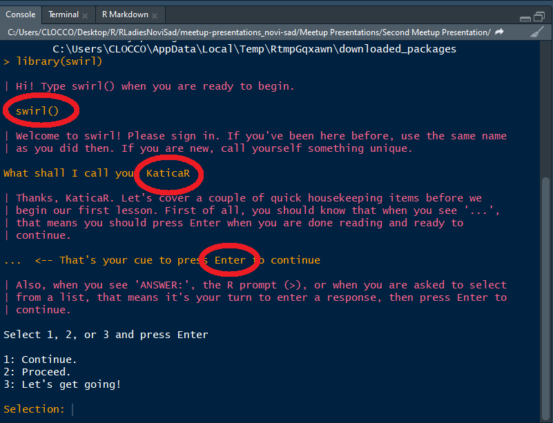


---
class: inverse, middle


background-image: url("Pozadina.png")
background-position: center
background-size: 96% 97%

# <span style="color:#a1007a"> ** Interakcija sa Swirl-om ** </span>

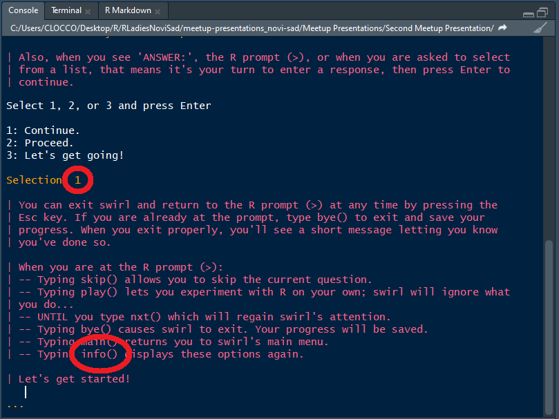


---
class: inverse, middle


background-image: url("Pozadina.png")
background-position: center
background-size: 96% 97%

# <span style="color:#a1007a"> ** Interakcija sa Swirl-om ** </span>

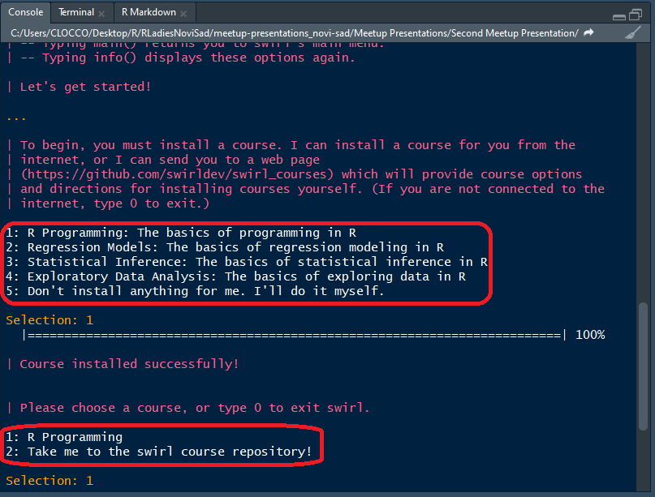


---
class: inverse, middle


background-image: url("Pozadina.png")
background-position: center
background-size: 96% 97%

# <span style="color:#a1007a"> ** Osnove R programiranja u Swirl-u ** </span>

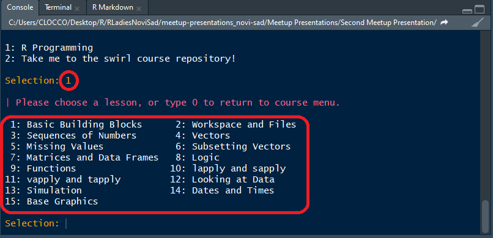


---

class: inverse, middle


background-image: url("Pozadina.png")
background-position: center
background-size: 96% 97%

# <span style="color:#a1007a"> ** Raspoloziva literatura ** </span>


[<span style="color:#0000cd"> ** R Boot Camp **](http://rbootcamp.rbind.io/day1/whatisr/)  

[<span style="color:#0000cd"> ** Osnove R-a **](https://rzanat.rs/)  

[<span style="color:#0000cd"> ** Base R Cheat Sheet **](https://rstudio.com/wp-content/uploads/2016/05/base-r.pdf) 

[<span style="color:#0000cd"> ** R for Data Science **](https://r4ds.had.co.nz/introduction.html)

[<span style="color:#0000cd"> ** Swirl **](https://swirlstats.com/) 


---

class: inverse, middle, center

background-image: url("Pozadina.png")
background-position: center
background-size: 96% 97%

## <span style="color:#a1007a"> ** Thanks for listening :) ** </span>

## <span style="color:#a1007a"> ** Follow us: ** </span>
#### [<span style="color:#a1007a"> Twitter: R - Ladies Novi Sad </span>](https://twitter.com/RLadiesNoviSad?s=03)      
#### [<span style="color:#a1007a"> Meetup: R - Ladies Novi Sad </span>](https://www.meetup.com/rladies-novi-sad/)
#### [<span style="color:#a1007a"> GitHub rladies </span>](https://github.com/rladies/meetup-presentations_novi-sad)
## <span style="color:#a1007a"> ** Contact us: ** </span>
## <span style="color:#a1007a"> **novisad@rladies.org** </span>     
### <span style="color:#a1007a"> Let us build projects together!</span>


<!-- I to bi bilo to! -->
<!-- Cestitamo! Savladali smo svi zajedno kako praviti prezentaciju u R-u. -->
<!-- Ovaj Tamplate slobodno mozete koristiri za VASU PRVU R PREZENTACIJU. -->
<!-- PUNO SRECE U UCENJU R-a ZELE TI R-LADIES NOVI SAD!-->
