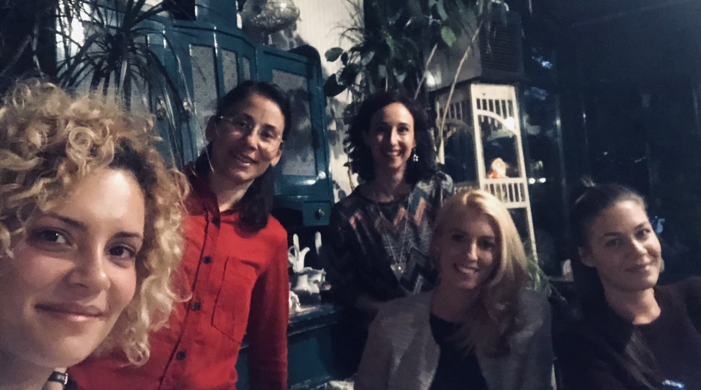

class: inverse, middle

background-image: url("rladies-wide-logo.png")
background-position: top right
background-size: 15% 10%

<!-- Tri crtice --- su pocetak slajda
A iznad njih su redom naslov, podnaslov, 
autor, datum, paket koji je koriscen i 
koji css fajlovi.-->

<!-- Zatim su postavljene
osobine slajda, tj. definisemo njegovu 
klasu koju posle mozemo menjati, tj. 
definisati unutar odgovarajuceg css fajla.-->

<!-- Nakon klase definisana je pozadina slajda.-->

#   ** Meet the Team ** 

<!-- # koristimo da stavimo doznanja R -u da je u pitanju naslov.
Ukoliko koristimo vise # kao sto je to ispit uradjeno, teks
ce biti manji.-->

<!-- Komanda  tekst  koristi se 
za menjanje boje teksta, u ovom slucaju boja iz R spektra 
je deeppink.-->

<!-- **tekst** Dve zvezdice ispred i nakon teksta koristimo da 
 potamnimo tekst, tj. za opciju bold. -->

.pull-left[
- ### Tatjana Kecojević
- ### Maja Pokuševski     
- ### Milena Kresoja 
- ### Katica Ristić
- ### Ranka Medenica Todorović
- ### Olivera Grljević
]

<!-- Komanda .pull-left[] i .pull-right[]
koristimo da prostor slajda podeli u dve kolone.
-->
<!-- Komanda jedna crtica sluzi da bi se oznacila
teza -->

.pull-right[

]

<!-- Ukoliko zelite da ubacite sliku/animacije koja nije pozadina 
to mozete uraditi komandom 
pri cemu mozete odrediti mesto prikazivanja slike, kao i njenu visinu/velicinu
-->

---

class: inverse, middle

background-image: url("Pozadina.png")
background-position: center
background-size: 96% 97%

#  ** We are a part of **     
#  ** R - Ladies Global ** 
---

class: inverse, middle

background-image: url("Pozadina.png")
background-position: center
background-size: 96% 97%

.pull-left[

]

.pull-right[
## Worldwide organisation that promotes gender diversity in the R community via meetups and mentorship in friendly and safe environment. 
]          

---
class: inverse, middle

background-image: url("Pozadina.png")
background-position: center
background-size: 96% 97%

.pull-left[

 - R-Ladies Global, designed to improve the gender diversity of R users worldwide and in particular, to improve the participation and experience of women in the R community.
]

.pull-right[

- **R-Ladies Novi Sad** will host a number of talks and workshops about the use of R. It doesn't matter if you never used R or if you are an R expert, **R-Ladies Novi Sad** welcomes anyone with an interest in R. 

- The goal is to promote R, exchange knowledge and create an R community among women. 

- We are fully inclusive and respectful of LGBT identities - our priority is to provide a safe community space for anyone identifying as female who is interested in and/or working with R.
]

---
class: inverse, middle

background-image: url("Pozadina.png")
background-position: center
background-size: 96% 97%

#   We're a part of it!   

---

class: inverse, middle

background-image: url("rladies-wide-logo.png")
background-position: top right
background-size: 15% 10%

#   ** Ovde ide neki od sledećih slajdova **  

---

class: inverse, middle

background-image: url("Pozadina.png")
background-position: center
background-size: 96% 97%

#  **Ili ovakvih sladova :) ** 

---

class: inverse, middle, center

background-image: url("Pozadina.png")
background-position: center
background-size: 96% 97%

##  ** Thanks for listening :) ** 

##  ** Follow R - Ladies Novi Sad on ** 
#### [ Twitter: R - Ladies Novi Sad ](https://twitter.com/RLadiesNoviSad?s=03)      
#### [ Meetup: R - Ladies Novi Sad ](https://www.meetup.com/rladies-novi-sad/)
#### [ GitHub rladies ](https://github.com/rladies/meetup-presentations_novi-sad)
##  ** Contact R - Ladies Novi Sad ** 
##  **novisad@rladies.org**      
###  Let us build projects together!

<!-- I to bi bilo to! -->
<!-- Cestitamo! Savladali smo svi zajedno kako praviti prezentaciju u R-u. -->
<!-- Ovaj Tamplate slobodno mozete koristiri za VASU PRVU R PREZENTACIJU. -->
<!-- PUNO SRECE U UCENJU R-a ZELE TI R-LADIES NOVI SAD!-->
