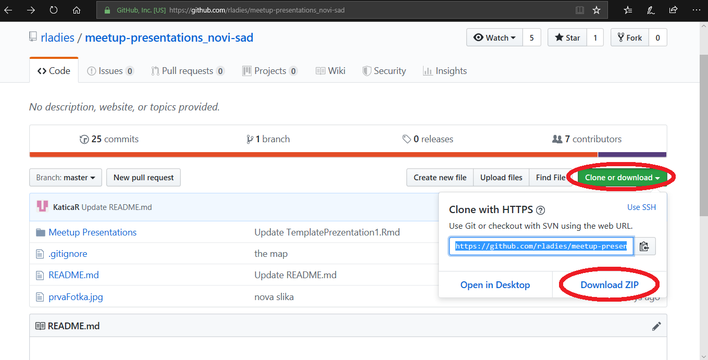
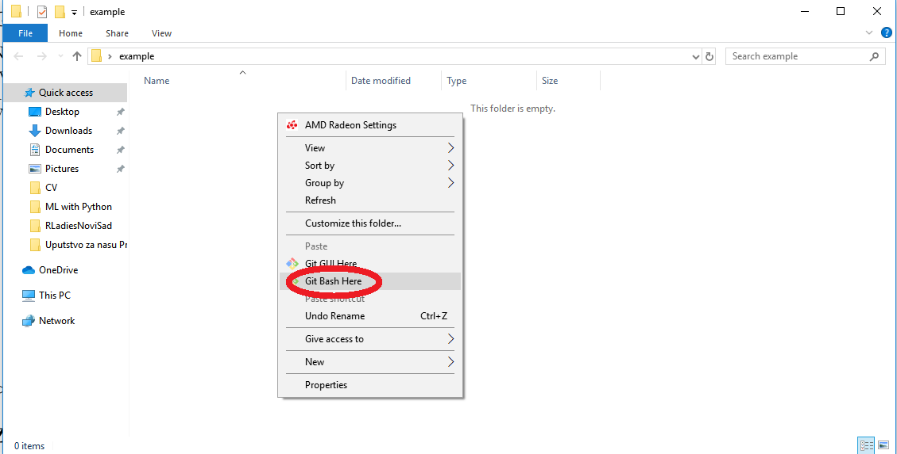
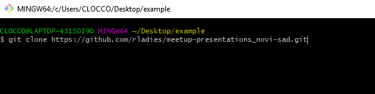
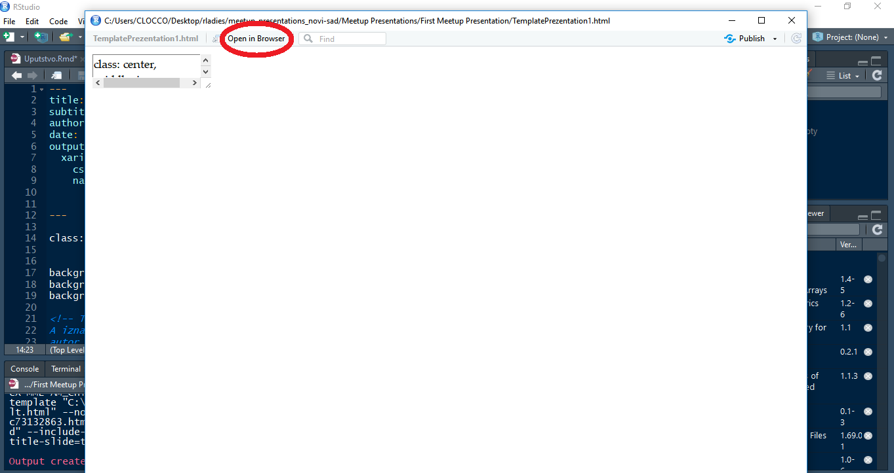

```{r setup, include=FALSE}
knitr::opts_chunk$set(echo = TRUE)
```
**Skinite ovaj pdf dokument sa GitHub-a uz pomoæ dugmeta Download (desno iznad dokumenta) da bi linkovi bili dostupni.**

## Kako instalirati R i RStudio

Potrebno je prvo instalirati [**R**](https://cran.r-project.org/bin/windows/base/) (mala napomena: veæina podebljanih reèi su linkovi, kliknite npr. na slovo R da biste otvorili link za instalaciju),
a zatim i [**RStudio**](https://cran.r-project.org/bin/windows/base/). Ukoliko imate potrebu možete pogledati i [**video**](https://www.youtube.com/watch?v=GAGUDL-4aVw) sa detaljnim postupkom. 

## GitHub R - Ladies Novi Sad

Na našoj [**GitHub**](<https://github.com/rladies/meetup-presentations_novi-sad>) stranici možete skinuti prezentaciju sa prvog Meetup-a. Napravljena je zajednièkim radom svih 6 koorganizatorki. Za neke od nas je to bilo prvo iskustvo ovog tipa :)  Kada se stranica otvori, kliknite na zeleno dugme **Clone or download** i odaberite opciju **Download ZIP**, ovaj fajl æete unzip-ovati na Vašem kompjuteru. Za one koji žele da se oprobaju u Git-u ovde Vam se nalazi i adresa koju treba kopirati. Ta adresa æe zajedno sa `git clone` biti prva naredba u Git-u.

{ width=65% } 
</center>

## Za malo naprednije korisnike - Kako koristiti **Git**

Pošto ste instalirali [**Git**](https://git-scm.com/downloads) i kopirali našu adresu sa GitHub-a, potrebno je da napravite na Desktop-u (ili gde god vama više odgovara) prazan folder, uðete u njega, kliknete desnim klikom i odaberete  **Git Bash here**.       
{ width=65% } 


\pagebreak
Otvoriæe Vam se Git prozor u kom æete na komandnoj liniji ukucati naredbu sa kopiranom adresom:      
      `git clone https://github.com/rladies/meetup-presentations_novi-sad.git`     
Na ovaj naèin æete skinete našu prezentaciju na Vaš raèunar.     
{ width=65% } 

Ukoliko kasnije želite na Vaš GitHub nalog da postavite našu prezentaciju i menjate je možete koristiti sledeæe komande:       

  - *Povlaèenje poslednje verzije sa GitHub - a*    
      `git pull`  
 - *Proveru trenutnog stanja, korisno ukoliko ste menjali fajl na vašem raèunaru*      
     ` git status`     
 - *Dodavanje svih izmena nastalih u prezentaciji*      
      ` git add * `    
 - *Komitovanje (izvršavanje) sa porukom*    
    ` git commit -m "tekst Vase izmene" `    
 - *Postavljanje na GitHub*    
      `git push `  

## Razumevanje i pokretanje prezentacije

U Vašem folderu se nalazi folder **meetup-presentations_novi-sad**, a prateæi putanju     

`C:\...\Desktop\VašFolder\meetup-presentations_novi-sad\Meetup Presentations\First Meetup Presentation `   

doæi æete do fajla **TemplatePrezentation1.Rmd**, pokrenite ga. Fajl æe se otvoriti u RStudio - u. 
Izmeðu znakova ```<!--``` i ```-->``` su upisani komentari koji objašnjavaju delove koda.      
{ width=65% }        
Uz pomoæ dugmeta **Knit** pokrenite prezentaciju. Pošto nemate odgovarajuæe pakete instalirane, RStudio æe se sam ponuditi da ih instalira za Vas. Pored toga æete ipak morati sami da instalirate [**xaringan**](https://bookdown.org/yihui/rmarkdown/xaringan-format.html) paket. U desnoj polovini prozora imate dugme Install, na koje kada kliknete otvara se mali prozor kao na slici, a zatim ukucajte ime paketa i kliknite opet na dugme Install. Nakon instalacije svih paketa, trebalo bi da pritiskom na dugme **Knit** Vaš RStudio otvori našu prezentaciju. 

\pagebreak
Ukoliko Vam se otvori ovakav prozor odaberite **Open in Browser**       
{ width=65% }

## Poziv na saradnju :)


Toliko od nas za poèetak :) Nadamo se da je ovaj naš prvi zajednièki projekat bio zanimljiv i koristan. Od sada pa nadalje sve naše rezultate koje budemo zajedno u R-u napravili moæi æemo veoma lako i prezentovati! Ako ste kojim sluèajem imali problem oko bilo èega iz ovog uputstva možete nam pisati na [**Meetup  stranici**](https://www.meetup.com/rladies-novi-sad/) ili na naš mail **novisad@rladies.org** i neko od nas æe Vam u najkraæem moguæem roku odgovoriti :) Na mail nam možete pisati i o Vašim sugestijama, projektima, idejama ili sponzorstvima (za poèetak bi trebalo na našim Meetup-ima obezbediti osveženje). 

Do skorijeg viðenja i druženja srdaèan pozdrav od      
 **R Ladies Novi Sad** 


